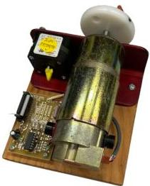
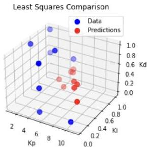
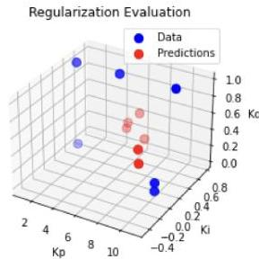
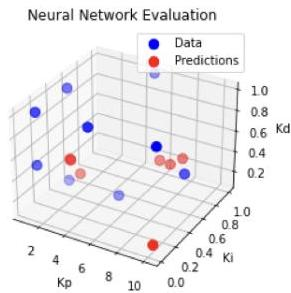
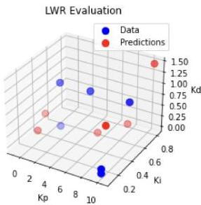
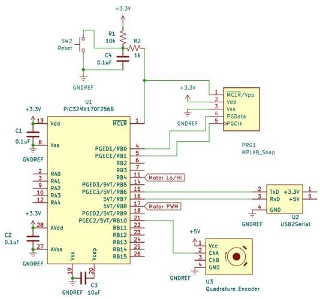
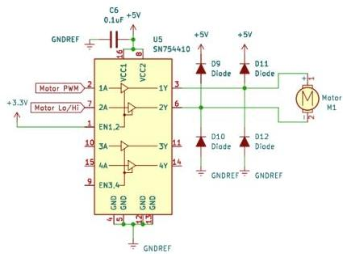

# Using Machine Learning to Find PID Constants for Desired Motor Behavior

Baxter Bartlett
Department of Mechanical Engineering
Stanford University
bbartl01@stanford.edu

## 1 Introduction

To move, the vast majority of robots make use of motors. To help attain desired velocities, the motors are typically controlled in a closed-loop fashion, meaning that the actual speed of the motor is measured and the error between the measured and desired speed is used to dictate the control effort. A typical control scheme is a PID controller, where the control effort is described by

$U=K_{p}e+K_{i}\int edt+K_{d}\frac{\partial e}{\partial t}$

where $e$ is the error and $K_{p}$, $K_{i}$, and $K_{d}$ are PID constants chosen by the programmer. These three constants control several aspects of the motor’s behavior, such as rise time (the time to change speeds), steady state error (the error between desired and actual motor velocities after changing speeds), and stability (a system’s ability to approach a constant speed after changing speeds). Typically, the goal is to chose PID constants that result in a stable system with minimal rise time and steady state error. However, finding such constants is not an easy task for two reasons: either no closed form equation exists or various nonlinearities of the motor (ex. friction, minimum activation voltage, maximum speed) render the traditional equations relating PID constants to control behaviors invalid. This leads to the purpose of this paper: to use machine learning methods to learn PID constants from control behaviors. In other words, the goal is to create an algorithm which takes a desired rise time, steady state error, and stability as inputs and outputs the PID constants that would achieve this behavior.

## 2 Related Work

Early approaches to finding ideal PID constants were more heuristic based, with the most notable approach coming from *Zeigler and Nichols (1942)*. In this approach, $K_{i}$ and $K_{d}$ are set to zero, and $K_{p}$ is gradually increased until the the system oscillates at a constant amplitude. The period of this oscillation (called the ultimate period) and the corresponding value of $K_{p}$ (called the ultimate gain) are then used in a set of nonlinear experimental equations to compute the ideal PID constants. While this method was a large step away from the traditional "trial and error" approach, it tended to produce rather large PID constants, which can cause a controller to become unstable in the face of sudden disturbances to the system. A similar approach which solved this issue was presented by *Åström and Hägglund (1984)*, which suggested that the ultimate gain and ultimate period could be found by driving a system to oscillation by instead using a bang-bang controller (a controller with only two control inputs). These heuristic methods were popular compared to the traditional "trial and error" approach since they required significantly fewer trials. However, both struggle to provide decent PID constants where system nonlinearities are nonnegligible, as can be the case in this particular task of motor control. Regardless, these methods see to accomplish a goal similar to that of this paper: determining PID constants based off measurements of control behavior.

With the growing popularity of machine learning came several model-based methods to finding ideal PID constants, with one such method coming from *Lin et al. (2003)*. This method proposed using a genetic algorithm to successively probe the system’s model to ultimately find ideal PID constants. A

Stanford CS229 Machine Learning

genetic algorithm is a stochastic algorithm which finds optimal parameters by taking several sets of randomized parameters, evaluating the cost that each incurs from the model-based objective function, and then breeding the sets in hopes of attaining sets with lower costs (breeding consists of keeping parameter sets with the lowest costs, swapping random parameters of some higher cost-incurring parameter sets, and randomly changing parameters of the remaining parameter sets). This method produced similar results to those of the heuristic methods while requiring far fewer measurements. However, this method deviates from the goal of this paper, as the dependency on a model requires measurements of model parameters (ex. friction, electrical resistance) instead of control behaviors - such parameters are not likely to remain constant.

Several non-model based methods also came about. One such method came from Cheon et al. (2015). This paper utilized a variation on neural networks called Deep Belief Networks to find the PID constants. This method is more aligned with the goals of this paper, with the only difference being the use of such an advanced method. Another method came from Dogru et al. (2022), which suggested making the PID constants nonconstant and using Reinforcement Learning to find ideal sequences of PID constants. This approach deviates from the goal of this paper, as the goal is to produce constants which can be hard-coded into the control code, whereas this approach looks to vary these constants over time. Regardless, these last two approaches are state-of-the-art approaches with great performance, with the only downside being that they are both very computationally involved.

# 3 Dataset and Features

Data was collected from a single 5V DC motor (shown in Figure 1) that was driven by a PIC32MX170F256B microcontroller (henceforth abbreviated as PIC). The wiring diagram of the circuit that was built for data collection can be found in Appendix A. Code was written to have the PIC drive the motor via PID control and to measure/store the speed of the motor. A total of 36 trials were run, with each trial following the procedure below

- Select  $K_{p}$  from one of three values,  $K_{i}$  from one of three values, and  $K_{d}$  from one of four values for the PIC to drive the motor with
- With the motor starting at rest, have the PIC drive the motor for 5 seconds using a setpoint (or desired velocity) of 30 RPM (30 RPM was chosen since the maximum speed of the motor was 50 RPM, and speeds near half of the maximum speed are appropriate for conducting step-response tests)
- During this 5 second period, have the PIC measure the velocity of the motor every millisecond and save the speed and timestamp in an array
- At the end of the 5 second period, have the PIC print the array to a terminal which could save print statements to a csv file

Figure 1: 5V DC Motor used for data collection

The input features (the control behaviors) from each trial were obtained from the trial's data in the following way:

# Rise Time

Since time  $t = 0$  corresponds to when the PIC began driving the motor, rise time was simply computed as the time when the motor first attained the setpoint.

Steady State Error
Due to various nonlinearities (ex. friction, electrical noise in both the motor and sensor), the motor will have some fluctuations in speed at steady state, making steady state error not constant (the traditional definition of steady state error assumes a constant error). Thus, steady state error was evaluated as the mean-squared error between the setpoint and measured velocity in the last 20% of the run. This percentage was chosen to ensure that the motor had reached steady state.

Stability
Traditionally, stability is a qualitative term (either a system is stable, marginally stable, or unstable). However, in order to create a regression model, stability needed to be quantified. Stability refers to whether a system approaches a constant value. Thus, it was chosen to evaluate stability as the ratio of number of measurements at the most common speed to number of measurements not at this speed, evaluated for all measurements after the first measurement of the most common speed. By this definition, higher values corresponded to a system that was more stable (the system was at the common speed more often than not, which is typical for stable systems) and low values corresponded to systems that were less stable.

As mentioned, a total of 36 trials were run. It was decided that for machine learning methods that didn’t have a hyperparameter, 27 trials (75% of the data) would be used for training the model and 9 trials (25% of the data) would be used for testing the model. As for methods that had a hyperparameter, 24 trials (67% of the data) would be used for training the model and the remaining 12 trials (33% of the data) would be evenly split between the validation and testing sets.

## 4 Methods

To recap, the goal is to develop a model that takes control behaviors as inputs and outputs the PID constants necessary to attain these behaviors. It is desirable for such a model to have a minimum MSE (Mean Squared Error) between the predicted PID constants and the actual PID constants for every prediction. Thus, any model should try to minimize some variant of

$\sum_{j=1}^{n}||y_{actual}^{(j)}-y_{pred}^{(j)}||_{2}^{2}$

where $y^{(j)}=[K_{p}^{(j)},K_{i}^{(j)},K_{d}^{(j)}]^{T}$ and $n$ is the number of predictions. This summation is equivalent to the square of the Frobenius norm of the Error Matrix, or

$||Y_{actual}-Y_{pred}||_{F}^{2}$

where $Y$ is a matrix with $y^{(j)}$ as column vectors

In this paper, four machine learning methods are examined. These methods were selected since they lend themselves rather nicely for creating models of multi-input/multi-output systems.

Method 1: Least Squares Regression
In Least Squares Regression, set $Y_{pred}=\theta X$, where $X$ is a matrix with $x^{(j)}=[RiseTime^{(j)},SteadyStateError^{(j)},Stability^{(j)}]^{T}$ as column vectors and $\theta$ is a matrix which effectively represents the system model. The goal is to find $\theta$ that minimizes $J=||Y_{actual}-\theta X||_{F}^{2}$. This minimization problem has a closed form solution (see Appendix B for derivation) given by

$\underline{\theta=YX^{T}(XX^{T})^{-1}}$

Method 2: Least Squares With Regularization
The addition of a regularization term to the Least Squares method constrains the solution space to sparse, less complex solutions. Such solutions are often more generalizable, or less susceptible to overfitting to the training data. Since the goal of this paper is to create a generalizable model, this method seems fair to try. The objective function to be minimized is now

$J=||Y_{actual}-\theta X||_{F}^{2}+\lambda||\theta||_{F}^{2}$

where $\lambda$ is a hyperparameter. This minimization problem has a closed form solution (see Appendix C for derivation) given by

$\underline{\theta=YX^{T}(XX^{T}+\lambda I)^{-1}}$

Method 3: Neural Network

Neural Networks are a nonlinear Machine Learning technique where measurements are linearly operated on, then passed through layers of nonlinear operations called activation functions. The linear operations are the parameters to solve for. In this paper, a simple, one-layer Neural Network is developed, where the activation function is the sigmoid function. In other words, the equations of the network are given by

$z^{(j)}=W^{[1]}x^{(j)}+b^{[1]}$
$a^{(j)}=\sigma(z^{(j)})$
$y^{(j)}_{pred}=W^{[2]}a^{(j)}+b^{[2]}$

The parameters $W^{[1]}$, $b^{[1]}$, $W^{[2]}$, and $b^{[2]}$ are solved for via back-propagation. Derivations for the backpropagation equations can be found in Appendix D. The objective function being minimized is $J=\sum_{j=1}^{n}||y^{(j)}_{actual}-y^{(j)}_{pred}||_{2}^{2}$.

Method 4: Locally Weighted Regression
Locally Weighted Regression is another nonlinear Machine Learning technique that assumes a nonlinear relationship. This technique linearizes the relationship in regions where the input is close to the training set. This linearization is performed by multiplying each squared error by a weight ranging from 0 to 1, with a higher weight corresponding to an input closer to the training set. In terms of an objective function to be minimized, this can be expressed as

$J=||(Y_{actual}-\theta X)\sqrt{W}||_{F}^{2}$

where $W$ is a diagonal matrix with nonnegative entries

$w^{(i)}=\exp\left(-\frac{||x^{(i)}-x||^{2}}{2\tau^{2}}\right)$

where $x^{(i)}$ is from the training set, $x$ is a point where $y$ is to be evaluated, and $\tau$ is a hyperparameter. Since $W$ is diagonal with nonnegative entries, then $\sqrt{W}\sqrt{W}=W$. This minimization problem has a closed form solution (see Appendix E for derivation) given by

$\underline{\theta=YWX^{T}(XWX^{T})^{-1}}$

## 5 Experiments / Results / Discussion

The efficacy of each technique was evaluated by computing the sum of MSEs for each prediction of the test set of data. This is more efficiently computed as

$MSE=\frac{||Y_{test}-Y_{pred}||_{F}^{2}}{3n}$

as the error matrix ($Y_{test}-Y_{pred}$) is a 3 by $n$ matrix where each term is an error.

Since Least Squares doesn’t have a hyperparameter, the training and testing of this model was straightforward, yielding a MSE of 3.80 on the test set. Given that the PID constants used when collecting data ranged from 0 to 10 (with $K_{i}$ and $K_{d}$ taking on values less than 1), the MSE reflects that the Least Squares approach does not model the PID constants - control behaviors relationship well.

The only hyperparameter of the Neural Network method is the learning rate used in gradient descent. Due to this system having 3 inputs and 3 outputs, the Neural Network method needed 24 parameters (9 for each matrix and 3 for each vector). Due to the small size of the dataset, the optimizing of this hyperparameter would have resulted in the training set having 24 points, meaning the Neural Network would be trained to fit the training set exactly. To avoid having to lose data to a validation set, the learning rate was chosen to be 1 since it was the lowest value in which the method converged. With this approach, the Neural Network attained a MSE of 1.21 on the test set.

Both the Regularization and Locally Weighted Regression methods have one hyperparameter ($\lambda$ and $\tau$ respectively), and thus saw similar methods of tuning the hyperparameter. After being trained on the training set, the hyperparameter was selected from a set of hyperparameters by finding

the hyperparameter that minimized the MSE with the validation set. Using this tuned hyperparameter, the models were then evaluated using the test set. With this approach, the Regularization method attained a MSE of 2.94 with the test set while the Locally Weighted Regression method attained a MSE of 0.85 on the test set.

To help visualize the efficacy of each model, the PID constant predictions were plotted in 3D space alongside the actual PID constants (see Figure 2). The closer the red dots are to the blue dots, the more accurate the model is. As seen, while the Neural Network and Locally Weighted Regression have a few decent predictions, none of the four methods show exceptional prowess at predicting the PID constants. Least Squares Regression performed the worst since it assumes a linear relationship between the control behaviors and the PID constants. This is not a good assumption as, even for linear systems, the PID constants aren't linearly related to the control behaviors. Regularization helped lower the MSE since it results in a more generalizable model that's less prone to overfitting, but still performs poorly since it assumes a linear relationship. Locally Weighted Regression was able to perform far better since it makes a less strict assumption, only assuming that the relationship between inputs and outputs can be linearly approximated near points of interest. This less stringent assumption inherently allows for a nonlinear model, which was apparently able to represent the PID constants - control behaviors relationship the best. The nonlinearity of the Neural Network method allowed it to also outperform the Least Squares and Regularization approaches. However, its efficacy was likely hindered by high variance. To elaborate, the Neural Network was trained on 27 data points. Recall that the Neural Network has 24 parameters to train. Having only three more training points than parameters makes a model susceptible to having high variance. This is not an issue with the Locally Weighted Regression Method since this method only had 12 parameters to train.

Figure 2: Comparison of PID Constant Predictions to Actual PID Values on Test Set for all four methods

# 6 Conclusion / Next Steps

In short, Least Squares Regression, Least Squares with Regularization, a single layer Neural Network, and Locally Weighted Regression were used to model the relationship between control behaviors and PID constants, with the Neural Network and Locally Weighted Regression performing better than the other two due to the nonlinearities inherent in the relationship trying to be modeled. Regardless, the two higher performing methods only had a handful of decent predictions. Future work could investigate whether obtaining more data would help with improving these two methods (as the small dataset certainly affected the performance of the Neural Network). It would also be interesting to explore the Deep Belief Network approach used by Cheon et al. (2015).

# 7 Acknowledgments

I would like to thank Dr. Ed Carryer for writing the Events and Services Framework (the C-code template which ME218 students use whenever working on a Mechatronics project). It was very helpful when creating the code used to drive the motor and collect data.

I would also like to thank Karl Gumerlock for loaning me the motor to perform the data collection.

Lastly, I would like to thank Dr. Moses Charikar. Having never learned about Machine Learning until this quarter, I found his lectures very insightful. I would definitely have done more with Deep Learning in this project had his lectures on Deep Learning been sooner in the quarter.

# 8 Appendices

Appendix A: Wiring Diagram of Circuit Built for Data Collection

# Appendix B: Derivation of Least Squares Closed Form Solution

The goal is to find  $\theta$  that minimizes  $J = ||Y - \theta X||_F^2$ . First rewrite the objective as a trace.

$$
J = T r \left(\left(Y - \theta X\right) \left(Y - \theta X\right) ^ {T}\right)
$$

The objective is minimized when

$$
\frac {\partial J}{\partial \theta} = 0
$$

$$
- 2 (Y - \theta X) X ^ {T} = 0
$$

$$
\theta X X ^ {T} = Y X ^ {T}
$$

$$
\theta = Y X ^ {T} (X X ^ {T}) ^ {- 1}
$$

# Appendix C: Derivation of Least Squares With Regularization Closed Form Solution

The goal is to find  $\theta$  that minimizes  $J = ||Y - \theta X||_F^2 +\lambda ||\theta ||_F^2$ . First rewrite the objective as a sum of traces.

$$
J = T r \left(\left(Y - \theta X\right) \left(Y - \theta X\right) ^ {T}\right) + \lambda T r \left(\theta \theta^ {T}\right)
$$

The objective is minimized when

$$
\frac {\partial J}{\partial \theta} = 0
$$

$$
- 2 (Y - \theta X) X ^ {T} + 2 \lambda \theta = 0
$$

$$
\theta (X X ^ {T} + \lambda I) = Y X ^ {T}
$$

$$
\theta = Y X ^ {T} (X X ^ {T} + \lambda I) ^ {- 1}
$$

Appendix D: Derivation/Explanation of Backpropagation for Neural Network

The equations of the Neural Network are given by

$z^{(j)}=W^{[1]}x^{(j)}+b^{[1]}$
$a^{(j)}=\sigma(z^{(j)})$
$y^{(j)}=W^{[2]}a^{(j)}+b^{[2]}$

The parameters $W^{[1]}$, $b^{[1]}$, $W^{[2]}$, and $b^{[2]}$ are to be solved for via back-propagation. In backpropagation, the parameters are updated with the following gradient descent rules:

$W^{[1]}:=W^{[1]}-\alpha\frac{\partial J}{\partial W^{[1]}}$
$b^{[1]}:=b^{[1]}-\alpha\frac{\partial J}{\partial b^{[1]}}$
$W^{[2]}:=W^{[2]}-\alpha\frac{\partial J}{\partial W^{[2]}}$
$b^{[2]}:=b^{[2]}-\alpha\frac{\partial J}{\partial b^{[2]}}$

While the objective function is still the Frobenius norm of the Error Matrix, it is more convenient to express the objective function as a summation of quadratics. Start by rewriting it as a summation of L2 norms

$J=\sum_{j=1}^{n}||y_{actual}^{(j)}-(W^{[2]}a^{(j)}+b^{[2]})||_{2}^{2}$
$J=\sum_{j=1}^{n}\left(y_{actual}^{(j)}-(W^{[2]}a^{(j)}+b^{[2]})\right)^{T}\left(y_{actual}^{(j)}-(W^{[2]}a^{(j)}+b^{[2]})\right)$
$J=\sum_{j=1}^{n}N_{j}$

The computation of $\frac{\partial J}{\partial W^{[2]}}$ and $\frac{\partial J}{\partial b^{[2]}}$ is straightforward

$\frac{\partial J}{\partial W^{[2]}}$
$\frac{\partial J}{\partial W^{[2]}}=\sum_{j=1}^{n}\frac{\partial N_{j}}{\partial W^{[2]}}$
$\frac{\partial J}{\partial W^{[2]}}=\sum_{j=1}^{n}-2(y_{actual}^{(j)}-(W^{[2]}a^{(j)}+b^{[2]}))a^{(j)}{}^{T}$
$\frac{\partial J}{\partial b^{[2]}}$
$\frac{\partial J}{\partial b^{[2]}}=\sum_{j=1}^{n}\frac{\partial N_{j}}{\partial b^{[2]}}$
$\frac{\partial J}{\partial b^{[2]}}=\sum_{j=1}^{n}-2(y_{actual}^{(j)}-(W^{[2]}a^{(j)}+b^{[2]}))$

Before $\frac{\partial J}{\partial W^{[1]}}$ and $\frac{\partial J}{\partial b^{[1]}}$ can be computed, $\frac{\partial N_{j}}{\partial a^{(j)}}$ and $\frac{\partial N_{j}}{\partial z^{(j)}}$ need to be computed.

$\frac{\partial N_{j}}{\partial a^{(j)}}$
$\frac{\partial N_{j}}{\partial a^{(j)}}=\frac{\partial}{\partial a^{(j)}}\left(y_{actual}^{(j)}-(W^{[2]}a^{(j)}+b^{[2]})\right)^{T}\left(y_{actual}^{(j)}-(W^{[2]}a^{(j)}+b^{[2]})\right)$

$$
\frac {\partial N _ {j}}{\partial a ^ {(j)}} = - 2 W ^ {[ 2 ] ^ {T}} \left(y _ {a c t u a l} ^ {(j)} - (W ^ {[ 2 ]} a ^ {(j)} + b ^ {[ 2 ]})\right)
$$

$$
\frac {\partial N _ {j}}{\partial z ^ {(j)}}
$$

$$
\frac {\partial N _ {j}}{\partial z ^ {(j)}} = \frac {\partial N _ {j}}{\partial a ^ {(j)}} \odot \frac {\partial a ^ {(j)}}{\partial z ^ {(j)}}
$$

$$
\frac {\partial N _ {j}}{\partial z ^ {(j)}} = \frac {\partial N _ {j}}{\partial a ^ {(j)}} \odot \sigma (z ^ {(j)}) \odot (1 - \sigma (z ^ {(j)}))
$$

Now  $\frac{\partial J}{\partial W^{[1]}}$  and  $\frac{\partial J}{\partial b^{[1]}}$  can be computed.

$$
\frac {\partial J}{\partial W ^ {[ 1 ]}}
$$

$$
\frac {\partial J}{\partial W ^ {[ 1 ]}} = \sum_ {j = 1} ^ {n} \frac {\partial N _ {j}}{\partial W ^ {[ 1 ]}}
$$

$$
\frac {\partial J}{\partial W ^ {[ 1 ]}} = \sum_ {j = 1} ^ {n} \frac {\partial N _ {j}}{\partial z ^ {(j)}} \frac {\partial z ^ {(j)}}{\partial W ^ {[ 1 ]}}
$$

$$
\frac {\partial J}{\partial W ^ {[ 1 ]}} = \sum_ {j = 1} ^ {n} \frac {\partial N _ {j}}{\partial z ^ {(j)}} x ^ {(j) ^ {T}}
$$

$$
\frac {\partial J}{\partial b ^ {[ 1 ]}}
$$

$$
\frac {\partial J}{\partial b ^ {[ 1 ]}} = \sum_ {j = 1} ^ {n} \frac {\partial N _ {j}}{\partial b ^ {[ 1 ]}}
$$

$$
\frac {\partial J}{\partial b ^ {[ 1 ]}} = \sum_ {j = 1} ^ {n} \frac {\partial N _ {j}}{\partial z ^ {(j)}} \frac {\partial z ^ {(j)}}{\partial b ^ {[ 1 ]}}
$$

$$
\frac {\partial J}{\partial b ^ {[ 1 ]}} = \sum_ {j = 1} ^ {n} \frac {\partial N _ {j}}{\partial z ^ {(j)}}
$$

## Appendix E: Derivation of Locally Weighted Regression Closed Form Solution

The goal is to find  $\theta$  that minimizes  $J = ||(Y - \theta X)\sqrt{W} ||_F^2$ , where  $W$  is a diagonal matrix with nonnegative entries, meaning  $\sqrt{W}\sqrt{W} = W$ . Rewriting this objective as a trace yields

$$
J = T r ((Y - \theta X) \sqrt {W} ((Y - \theta X) \sqrt {W}) ^ {T})
$$

$$
J = T r ((Y - \theta X) \sqrt {W} \sqrt {W} (Y - \theta X) ^ {T})
$$

$$
J = T r ((Y - \theta X) W (Y - \theta X) ^ {T})
$$

$$
J = T r ((Y W - \theta X W) (Y ^ {T} - X ^ {T} \theta^ {T}))
$$

$$
J = T r (Y W Y ^ {T} - Y W X ^ {T} \theta^ {T} - \theta X W Y ^ {T} + \theta X W X ^ {T} \theta^ {T})
$$

Since  $Tr(A + B) = Tr(A^T + B)$ ,

$$
J = T r (Y W Y ^ {T} - \theta X W Y ^ {T} - \theta X W Y ^ {T} + \theta X W X ^ {T} \theta^ {T})
$$

$$
J = T r (Y W Y ^ {T} - 2 \theta X W Y ^ {T} + \theta X W X ^ {T} \theta^ {T})
$$

The objective is minimized when

$$
\frac {\partial J}{\partial \theta} = 0
$$

$$
- 2 Y W X ^ {T} + 2 \theta X W X ^ {T} = 0
$$

$$
\theta X W X ^ {T} = Y W X ^ {T}
$$

$$
\theta = Y W X ^ {T} (X W X ^ {T}) ^ {- 1}
$$

References

Kangbeom Cheon, Jaehoon Kim, Moussa Hamadache, and Dongik Lee. 2015. On replacing PID controller with deep learning controller for DC motor system. In Journal of Automation and Control Engineering.

Oguzhan Dogru, Kirubakaran Velswamy, Fadi Ibrahim, Yuqi Wu, Arun Sundaramoorthy, Biao Huang, Shu Xu, Mark Nixon, and Noel Bell. 2022. Reinforcement learning approach to autonomous PID tuning. In Computers and Chemical Engineering.

Chun-Liang Lin, Horn-Yong Jan, and Niahn-Chung Shieh. 2003. GA-based multiobjective PID control for a linear brushless DC motor. In IEEE/ASME Transactions on Mechatronics.

J.G. Zeigler and N.B. Nichols. 1942. Optimum settings for automatic controllers. In Journal of Fluids Engineering.

K.J. Åström and T. Hägglund. 1984. Automatic tuning of simple regulators with specifications on phase and amplitude margins. In Automatica.

