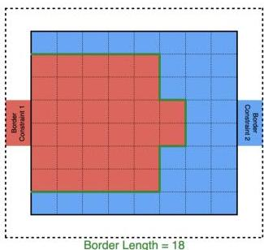
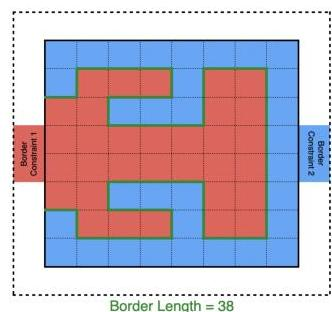
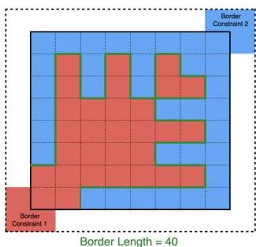
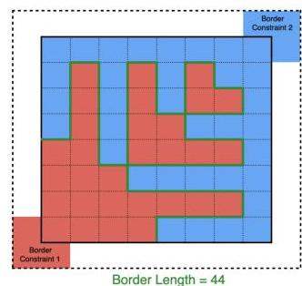
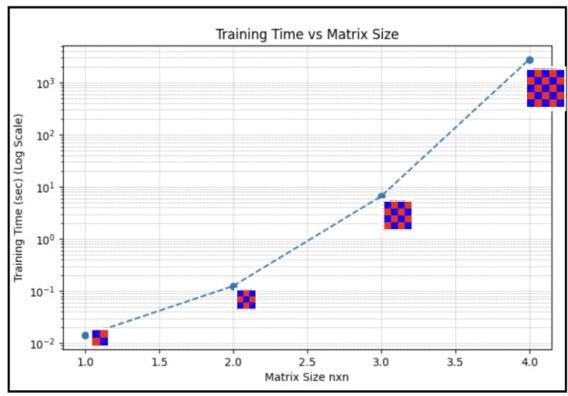
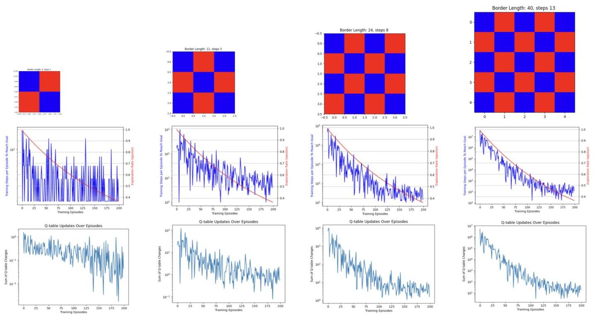
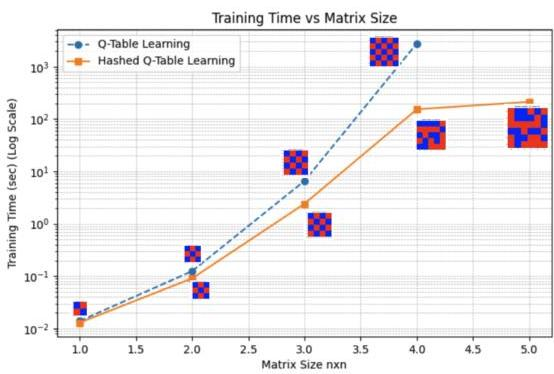
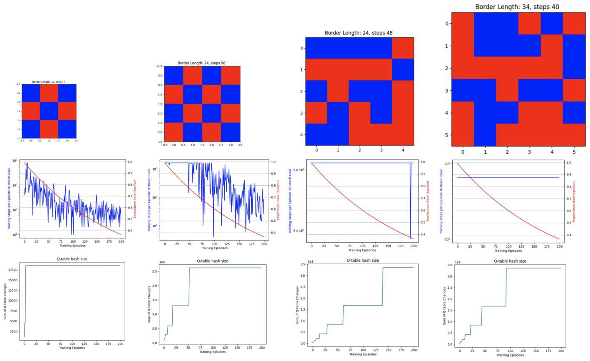
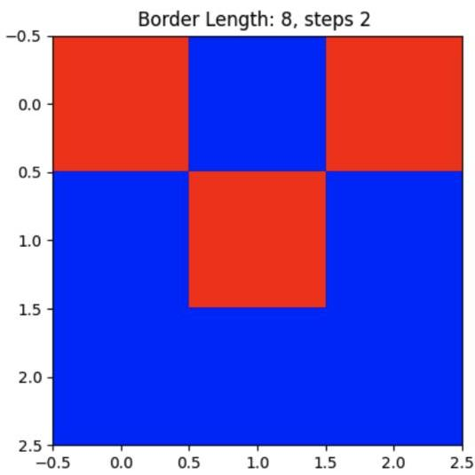

# Reinforcement Learning Optimization Tool for Pixel Design

Amin Zareianjahromi
aminz@stanford.edu

Abstract—This project explores reinforcement learning (RL) for optimizing pixel selection (e.g., red and blue pixels) under predefined constraints (e.g., a 50/50 split distribution of red and blue regions). The goal is to maximize the border length (number of adjacent red-blue pixel pairs). Two reinforcement learning methods, Q-learning and Deep Q-Learning are used to iteratively improve pixel configurations. where interfaces between two regions need to be optimized. This border is defined as the number of adjacent pixels where one is red and the other is blue.

# I. INTRODUCTION

The main goal is to apply reinforcement learning (RL) to optimize the arrangement of red and blue pixels in a matrix while maintaining an even distribution of the two colors. The key challenge is to maximize the border length between regions of different colors. This approach could have applications in image segmentation, where the contrast between different sections needs to be maximized.

This border length (green line) is represented by the number of adjacent pixels with different colors (red and blue).






Fig. 1. original image representation of the proposal idea



# II. PROPOSED APPROACHES

As a first approach to attack this problem, we used a reinforcement learning environment where an agent iteratively

improves the configuration of red and blue pixels in a matrix. The agent's actions involve flipping pixel values to maximize the desired border. The RL agent is rewarded based on the increase of the border length between differently colored regions. If flipping a pixel causes increase of border length, the agent is positively rewarded by the border length increase. If the flipping a pixel causes decrease of the border length, the agent is negatively penalized by the amount of the border length reduction. The theoretical maximum border length for a matrix can be modeled and calculated separately as an ideal target for this optimization problem while providing an easy and visual insight into how well the optimization algorithm is working.

We utilized a custom RL environment provided by OpenAI's Gym. The environment allows an RL agent to interact with a pixel matrix and iteratively optimize its configuration. The agent flips pixel values (red blue) to maximize the desired border. The reward function based on changes in the border length  $s$  added to the environment.

Initially we are using a Q-learning algorithm to train the agent to maximize the border length. The Q-learning algorithm enables the agent to explore and exploit strategies that can improve the configuration, making the agent more efficient over time.

Furthermore, a Deep Q-learning algorithm is also explored as the training algorithm to understand pros and cons compared to the Q-learning algorithm.

# III. DATASET AND FEATURES

Dataset is synthetically created using "openAI's Gym MatrixEnvironment". This module in combination with some custom functions to calculate or update border length provide an easy way to create matrices with different size, flip pixel, run multiple training episodes and lastly visualize the final result and/or each state of each training step for debug purposes. The features we considered for training the RL agent include:

- Current border length: The total length of the borders between red and blue region

In the project proposal, we proposed 50/50 balance of red and blue, regions continuity and border constraint as features. However, the optimization algorithm converged to 50/50 balanced and continuous region without enforcing this. This appears to be required to get maximum border region and we dropped enforcing these conditions as an external feature. This was achieved by algorithm naturally without enforcing it.

# IV. PROBLEM FORMULATION

The problem is modeled as a reinforcement learning task, where:

1. Environment: A custom Gym environment was implemented with the following key elements:

- State: The current matrix configuration. This is a list of size of  $(MatrixSize)^2$ . One of the issues which we will discussed in a latent section is related to the number of possible states. In this case, each matrix pixel could have two values (red and blue). This results in total number of state of  $2^{(MatrixSize)^2}$ . This grows very quickly as the size of the matrix increased.
- Action Space: Flipping the value of any pixel This results in  $(MatrixSize)^2$  possible actions.
- Reward: Based on the incremental change in border length. If flipping a pixel causes increase of border length, the agent is positively rewarded by the border length increase. If the flipping a pixel causes decrease of the border length, the agent is negatively penalized by the amount of the border length reduction.
- Initialize: The matrix starts with a random split between red and blue pixels.
- Visual Rendering: The environment also supports visualization, which provides a clear understanding of the agent's progress during training and testing.

# 2. Agent Training:

The agent was trained using a Q-learning algorithm with the following hyper-parameters:

- Learning Rate  $(\alpha)$ : 0.1, this sets how fast the Q-table is updated based on the observed state/action pair
- Discount Factor  $(\gamma)$ : 0.99, as a typical value for this parameter, put more emphasis on the current observed reward as oppose to the future reward.
- Exploration Rate  $(\epsilon)$ : Initially set to 1.0, decayed gradually to 0.01 over training poolsides. This controls how we pick the next action at each state, if it is random (a.k.a exploration of states) or using Q-table recommendation (a.k.a exploitation)

# 3. Metrics:

- Border Length: The total count of adjacent red-blue pixel pairs. An optimal and successful training results in 4-checker pattern which has the highest border length.
- Training Time: Time required for the agent to complete training loops.


Fig. 2. Training time exponentially increases with regard to Matrix size

# V. IMPLEMENTATION 1: Q-LEARNING

The reinforcement learning agent was implemented using Q-learning. Q-learning works by watching an agent play and gradually improving its estimates of the Q-values. Once it has accurate Q-value estimates then optimal policy is just choosing the action that the highest Q-value :

$Q(s,a)\coloneqq Reward + \gamma .maxarg_{a^{\prime}}Q(s^{\prime},a^{\prime})$

For each state-action pair (s,a), this algorithm keeps track of a running average of the rewards rthe agent gets upon leaving the sate s with action a, plus sum of discounted future rewards it expects to get. To estimate this sum, we take the maximum of the Q-value estimates for the next state  $s'$ , since we assume that the target policy will act optimally from then on.

```python
while not done:
if random.uniform(0, 1) &lt; epsilon:
action = env.action_space.sample()
else:
action = np.argmax(Q_table[state_index])
new_state, reward, done, _ = env step( action)
new_state_index = int("".join(map(str, new_state.flatten)), 2)
# Update Q-table
Q_table[state_index, action] = Q_table[ state_index, action] + alpha * ( reward + gamma * np.max(Q_table[ new_state_index]) - Q_table[ state_index, action])
state_index = new_state_index
```

# VI. EVALUATION METRICS

To evaluate the performance of the RL agent, we used the following:

- Border Length: The primary evaluation metric is the final border length achieved after training. Higher border lengths indicate better configurations. The maximum border length is achieved for 4-checker (chess board) style design with absolute border length of  $2[MatrixSize - 1] * [MatrixSize]$ . If RL agent


Fig. 3. Training for 200 episodes while decaying the  $\epsilon$  exploration factor. Showing training steps to converge in each episode as well as Q-table rate of update


Fig. 4. Comparing Q-table vs Hashed Q-Table for training time

converges to this design, it means that Q-table learning is performing well. Any other design and associated border length is sub-optimal solution.

- Training Time: Another parameter to monitor for the performance of the RL agent is the training time to converge. In this case, we ran all cases for 200x episodes to be consistent.
- Visualizations: of the matrix configuration provide insights into how well the agent has learned to maximize the red-blue border. We used matplotlib to visualize the matrix, using blue and red colors for the cells.

# VII. TEST SETUP

After training Q-table, the agent is tested on a new random initial matrix. It was found that the action selection shall still have a small percentage of exploration to prevent it from getting stuck in a sub-optimal state. This issue is mainly observed for large matrix size where the Q-table is probably not fully optimized due to limited training episodes of 200.

```python
Test the trained agent
if test == True:
state = env.reset()
done = False
state_index = int("".join(map(str, state.flatten())), 2)
while not done:
epsilon = 0.001
if random.uniform(0, 1) &lt; epsilon: # Explore action space
action = env.action_space.sample()
else: # Exploit learned values
action = np.argmax(Q_table[ state_index])
state, reward, done, _ = env step( action)
state_index = int("".join(map(str, state.flatten())), 2) % len( Q_table)
env.render()
```

# VIII. RESULT ANALYSIS

Fig. 2 shows the required training time for  $200\mathrm{x}$  training episodes with respect to the matrix size. As the plot shows, the required training time exponentially increases with respect


Fig. 5. Implementation 2 hashed Q-table, Training for 200 episodes while decaying the  $\epsilon$  exploration factor.

to the matrix size, for example from mili second range for small matrix to  $15\mathrm{min}$  for  $5\times 5$  matrix. This is due to the fact the Q-table has the size of the  $2^{(MatrixSize)^2}$  which is the total number of the possible states. This increases as the size of the matrix increases and the training becomes longer for larger matrices for example 6x6 and beyond.

Fig. 3 first row shows the result of the testing loop on a random initial matrix. The best possible design is discovered by the RL agent which is using the trained Q-table. This is confirmed by the visual presentation of the final matrix. Border length for each case is  $2[MatrixSize - 1] * [MatrixSize]$  and the agent is able to find this optimal design in few steps, for example 13 steps for 5x5 matrix.

Fig. 3 second row shows the number of training steps per episode before reaching the optimal solution of max border length. The  $\epsilon$  value which controls the exploration vs exploitation rate is also reduced over the episode number (red line) to push the agent using the Q-table more and more toward the end of the training episodes. This helps reducing training time as we train the Q-table. As Q-table becomes more mature over the training episodes, the RL agent converges to optimal solution in fewer steps. For example, RL agent is running for  $10^{7}$  steps with  $\epsilon$  close to 1 at the beginning, while RL agent only runs for 100-220x steps during the final episodes when the  $\epsilon$  is close 0.1.

Fig. 3 third row shows the Q-table variation from episode

to episode. As it shows the Q-table variation is large during initial episodes and it quickly converge to a more stable Q-table with less variation during training.

# IX. IMPLEMENTATION 2 - HASHED Q-TABLE LEARNING

As mentioned in the first implementation, the size of the Q-table grows exponentially and makes the training time and memory super large for large matrices. In order to add a control knob on the size of the Q-table and control the training time and prevent the computing HW crash, we added a hashed table. The size of the hashed table is controlled within a reasonable size. The cost of this approach is getting suboptimal test design. However, the algorithm would eventually converge without getting stuck. The

```python
while not done:
if random.uniform(0, 1) &lt; epsilon:
action = env.action_space.sample() # Explore action space
else:
if state_hash in Q_table:
action = np.argmax(Q_table[ state_hash]) # Exploit learned values
else:
action = env.action_space.sample() # If state not in Q-table, explore

```python
new_state, reward, done, _ = env step( action)
new_state_hash = env_hash_state(new_state)
if state_hash not in Q_table: Q_table[state_hash] = np.zeros(env. action_space.n)
if new_state_hash not in Q_table: Q_table[new_state_hash] = np.zeros(env. action_space.n)
# Update Q-table
Q_table[state_hash][action] = Q_table[ state_hash][action] + alpha * ( reward + gamma * np.max(Q_table[ new_state_hash]) - Q_table[ state_hash][action])
```

Fig. 4 shows the training time saving achieved with this second implementation. The size of the hashed table is controllable and we can decide on how long we want to training the RL agent. The training time saving is more than order of magnitude for large matrices.

Fig. 5 first row shows the final design from test setup. The agent was able to achieve the optimal 4-checker design up to  $4 \times 4$  matrix size. As the training time was limited for the  $5 \times 5$  and  $6 \times 6$  matrices, the final design achieved by the RL agent is suboptimal.

Fig. 5 second row show the number of steps required to achieve the optimal design during each episode. Again for larger matrix sizes the optimal design was not achieved as the training time was limited.

Fig. 5 last row shows the size of the hashed table increased during the training. As it can be seen, the size is capped for the larger matrices to control the training time and prevent the hardware from getting stuck and crashed. It is possible to achieve more optimum design if further optimization on the hyper parameter is explored. We stop this exploration at this sage.

# X. IMPLEMENTATION 3 - DEEP Q LEARNING

This is the third and last implementation methodology we explored for this problem statement. The idea is to replace the Q-table with a neural network. Instead of explicitly maintaining a table of Q-values for each state-action pair (which becomes infeasible for large state spaces), we train a neural network to approximate the Q-values. To stabilize training, we use a replay buffer to store past experiences. During training, random mini-batches are sampled from this buffer to break correlations between consecutive experiences and improve learning efficiency.

```python
DQN parameters
input_dim = matrix_size ** 2
output_dim = env.action_space.n
policy_net = DQN(input_dim, output_dim).to(device)
target_net = DQN(input_dim, output_dim).to(device)
target_net.load_state_dict(policy_net.state_dict())
target_net.eval()
```


Fig. 6. Test run on DQN alg. showing suboptimal result

```python
optimizer = optim.Adam(policy_net.params(), lr=learning_rate)
criterion = nn.SmoothL1Loss()
def select_action(state, epsilon):
if random.uniform(0, 1) &lt; epsilon:
return env.action_space.sample()
else:
state = torch.tensor(state.flatten(), dtype=torch.float32).to(device)
with torch.no_grad():
q_values = policy_net(state)
return torch.argmax(q_values).item()
def optimize_model():
if len(memory) &lt; batch_size:
return
batch = random.sample(memory, batch_size)
states, actions, rewards, next_states, dones = zip(*batch)
states = torch.tensor(np.array(states), dtype=torch.float32).to(device)
actions = torch.tensor(actions, dtype=torch.float32).unsqueeze(1).to(device)
current_q_values = policy_net(states).gather(1, actions)
next ACTIONS = torch.argmax(policy_net(next_states), dim=1).unsqueeze(1)
next_q_values = target_net(next_states).gather(1, next ACTIONS)
target_q_values = rewards + (gamma * next_q_values * (1 - dones))

loss = criterion(current_q_values, target_q_values)
optimizer.zero_grad()
loss.backward()
optimizer.step()
# print(f’loss: {max(abs(current_q_values - target_q_values))} --- loss.item():
{loss.item()} ’)
return loss.item()
# Training Loop
while not done:
action = select_action(state, epsilon)
next_state, reward, done, _ = env.step( action)
total_reward += reward
# Store transition in memory
if len(memory) >= max_memory_size: memory.pop(0)
memory.append((state.flatten(), action, reward, next_state.flatten(), done))
state = next_state
loss_report = optimize_model()
step_num += 1

As Fig. 6 shows above, this implementation was developed using PyTorch module. The NN has two hidden layer and elu as activation function. The result of this implementation was poor compared to Q-table specially for small size matrix. The training time due to training NN was longer and RL agent was not able to achieve the similar performance as the thw previous implementation.

## XI Conclusion

The application of reinforcement learning to maximize the border length in a matrix of red and blue regions is successfully implemented and analysis-ed using Q-table. The Q-table implementation provides a straightforward path to training and converge to optimal design. However, the training time and required memory exponentially increases with respect to the matrix size. The other two extra algorithm implementation of Hash Q-table and Deep Q-learning were explored to improve the training time and memory. Some improvements were observed at the cost of converging to sub-optimal design. Further scrubbing and hyper parameter optimization for these extra two implementations might improve the effectiveness and can be considered as next steps.

## XII Next Steps

- Hash Q-table and Deep Q-learning: as mentioned, the current implementation doesn’t achieve optimal design for large matrices and further hyper parameter optimization might help improving these extra implementations.

## XIII References

Generative design by reinforcement learning: Enhancing the diversity of topology optimization designs”Authors: S. Jang, S. Yoo, N. Kang, Computer-Aided Design (2022)

RL-OPC: Mask Optimization with Deep Reinforcement Learning, Authors: X. Liang, Y. Ouyang, H. Yang, B. Yu, IEEE Transactions on Computer-Aided Design of Integrated Circuits and Systems (2023)

PixelRL: Fully convolutional network with reinforcement learning for image processing”, Authors: R. Furuta, N. Inoue, T. Yamasaki, IEEE Transactions on Image Processing (2019)

