# PickNet: Deep Dive into Complex Trash Classification

Jenny Chen
SUNet ID: jennycjx
Stanford University
&Boyu Han
SUNet ID: boyuhan
Stanford University
&Coco Xu
SUNet ID: cocozxu
Stanford University

###### Abstract

Recycling is essential for reducing energy consumption and combating climate change; however, 76% of recyclable materials in the U.S. are discarded due to contamination. This project presents a machine learning approach to automate trash sorting, expanding classification to 20 categories from the standard 12. Our CNN-based model achieved 96% accuracy for single-object classification. Since trash is often processed in piles, we developed a YOLOv10 + CNN model that achieved 75% accuracy for multi-object classification tasks. Further experimentation on fine-tuning YOLOv10 by freezing specific layers revealed that freezing layers 7–10 and 23 enhanced predictions while maintaining training efficiency. This work advances recycling automation and supports zero-waste initiatives.

## 1 Introduction

Recycling is crucial for reducing energy consumption and combating climate change, yet a staggering 76% of recyclable materials in the U.S. end up discarded due to contamination. Current waste management systems heavily rely on manual sorting, a process that is both error-prone and inefficient. Mixing non-recyclables with recyclables significantly lowers the quality and marketability of the recycled materials, which hampers high recycling rates. For example, at Stanford, the zero-waste initiative aims to address waste issues by 2030, yet a recent study indicates that 26% of landfill-bound waste is actually recyclable and 36% is compostable.

To address this persistent problem, we propose a machine learning approach designed to automate trash sorting. While there have been attempts to classify trash using neural networks, previous work has primarily focused on single-object classification and limited the categories to around 10 different types. In this work, we introduce a CNN-based approach that can take images of single-object trash as input and output its category. Our model is capable of classifying 20 categories of trash, thereby simplifying the downstream recycling process. Furthermore, we extend this work to multi-object trash detection using a YOLO-based model. This model can take an image as input and output a list of detected trash items along with their corresponding category labels. Our system aims to significantly reduce human error in the sorting process, thereby increasing recycling rates and contributing to efficient waste management.

## 2 Related Work

### 2.1 Computer Vision for Waste Sorting

Waste classification has been approached using both traditional and deep learning-based methods. Non-deep learning techniques, such as K-Nearest Neighbors, Support Vector Machines, and Decision Trees, have been applied to classify waste, demonstrating feasibility for simpler datasets *[2]* *[8]* *[1]*. However, these methods often fall short in handling the complexity of real-world situations. Deep learning methods have shown greater promise, one study utilized a CNN combined with an

autoencoder to classify images as containing either organic or recyclable trash, achieving an accuracy of 99.95% *[10]*. While effective, this work was limited to binary classification. Another study leveraged the YOLO architecture to detect multiple paper and plastic on water surfaces, reaching an accuracy of 63% *[6]*. Although YOLO demonstrated its capability for real-time detection, the scope was restricted to only two categories, and the accuracy can still be improved. Notably, prior work has generally been constrained to classifying at most six categories, highlighting the need for more granular classification systems *[5]*. This work addresses this limitation by focusing on 20 categories, enabling a more comprehensive and scalable solution for waste sorting in realistic scenarios.

### 2.2 Robotics for Waste Sorting

Robotics has emerged as a promising solution to address the challenges of manual waste sorting by integrating robotic arms into the process and creating semi-automatic systems. These systems allow robots to perform coarse screening tasks, such as removing oversized items, cutting or untangling long objects, and safely extracting hazardous components like batteries, while humans assist with more complex sorting tasks *[4]*. However, implementing robotics in waste sorting presents several challenges. First, the hardware must grasp items of varying sizes and materials. Second, sensors must accurately recognize object categories, shapes, poses, and conditions in wet and dirty environments. Finally, planning systems must generate efficient sorting sequences and trajectories. Our work falls into the second category, and we hope that a finer granularity algorithm will further alleviate human effort in sorting solid wastes.

## 3 Methods

### 3.1 CNN

We utilized a CNN based approach to classify our single image datasets. Neural networks is especially useful in image classification training as the layers that we introduced are able to maintain all the information and features while reducing the dimensionality of an image. In our implementation, for each layer, we used Relu as our activation function. Additionally, we introduced pooling functions to reduce dimensionality. Finally, we used softmax function to calculate the probability of each category.

$softmax(x_{i})=\frac{e^{x_{i}}}{\sum_{j=1}^{n}e^{x_{j}}}$

We also implemented an enhanced model using transfer learning from ResNet with custom layers.

### 3.2 YOLO

YOLO (You Only Look Once) *[7]* is a real-time object detection algorithm that reframes object detection as a single regression problem rather than a pipeline of individual steps like region proposal and classification. Given an input image, YOLO divides it into an $S\times S$ grid, where each grid cell is responsible for detecting an object if the center of that object falls within the cell. Each cell predicts a fixed number $B$ of bounding boxes and their associated confidence scores, indicating both the likelihood of an object being present and the accuracy of the bounding box prediction. The model also predicts class probabilities for each bounding box, enabling it to classify detected objects. YOLO’s loss function, $\mathcal{L}$, optimizes both classification accuracy and localization precision, often combining mean squared error for coordinates and cross-entropy for class predictions. Mathematically, this can be expressed as:

$L=\lambda_{coord}\sum_{i=0}^{S^{2}}\sum_{j=0}^{B}1_{ij}^{obj}\left((x_{i}-\hat{x}_{i})^{2}+(y_{i}-\hat{y}_{i})^{2}\right)+\sum_{i=0}^{S^{2}}\sum_{j=0}^{B}1_{ij}^{obj}\left((\sqrt{w_{i}}-\sqrt{\hat{w}_{i}})^{2}+(\sqrt{h_{i}}-\sqrt{\hat{h}_{i}})^{2}\right)+$
$\sum_{i=0}^{S^{2}}\sum_{j=0}^{B}1_{ij}^{obj}\left(C_{i}-\hat{C}_{i}\right)^{2}$

where

Here,  $1_{ij}^{obj}$  is an indicator function that signals whether the object  $j$  appears in the cell  $i$ . YOLO's end-to-end differentiable approach enables fast, high-accuracy predictions, making it a significant influence on real-time object detection advancements.

In the experiments, we utilize the YOLOv10 model for multi-object detection on a custom trash dataset, aiming to optimize detection accuracy for task-specific requirements. The YOLOv10 architecture comprises two main components: the backbone (layers 0-10) for feature extraction and the detection head (layers 11-23) for object detection and classification. The backbone employs convolutional layers, C2f modules, and SCDown modules to progressively encode multiscale features, while the detection head fuses these features via upsampling and concatenation to generate bounding boxes and class labels.

# 4 Data

For the single-object classification task, we compiled a dataset comprising 20 trash categories. Twelve categories were sourced from an existing Kaggle dataset  $^{1}$ , while the remaining eight were supplemented with images collected through web scraping. We collected a total of 6279 data samples.

Training a YOLO model requires labeled multi-object data, which is challenging to obtain. To overcome this, we created a custom dataset using single-object images. This process involved manually segmenting five objects per category with LabelBox to produce segmentation maps. We then generated composite images by randomly sampling 2 to 9 objects and sequentially adding them to a blank canvas, varying their sizes and angles to mimic real-life scenarios. Overlapping objects were included to increase complexity and realism. This approach resulted in a dataset of 2000 samples for the multi-object classification task.

During training, we split the dataset to  $80\%$  training date and  $20\%$  testing data. We also augmented the dataset through random rotation and flipping.

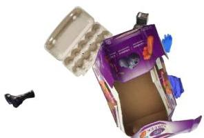
Figure 1: Example data

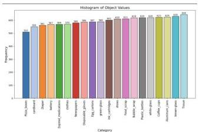
Figure 2: Number of objects in different category

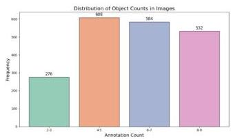
Figure 3: Number of objects in each data

# 5 Experiments and Results

# 5.1 Single-object Detection

As discussed in Section 2, many previous experiments in waste classification relied on non-deep learning methods. To establish a baseline for our project, we selected the K-Nearest Neighbor (KNN) algorithm. Additionally, given the high dimensionality of our image data (224 x 224 pixels), we applied Principal Component Analysis (PCA) to extract meaningful features before running KNN. Lastly, to tune the hyper-parameter  $k$ , we report the highest accuracy achieved across all tested values of  $k$  (from 1 to 20). The result accuracy is recorded in Table 1.

A better way to perform this task is to use deep learning based models. We compared our CNN-based models with other baseline models such as resnet18[3], inceptionV3 fine-tuned to our data [9]. All the models were trained with a learning rate of 0.001, a mini-batch size of 16, and for 15 epochs, using the Adam optimizer. Based on the test results, our model outperforms (achieving an test accuracy of  $96\%$ ) the other models. Appendix 910 shows the model's performance. (For detailed training and test loss as well as accuracy charts, please refer to the Appendix.)

|  Model | Test Accuracy  |
| --- | --- |
|  KNN | 0.39  |
|  KNN + PCA (500 features) | 0.39  |
|  KNN + PCA (1000 features) | 0.41  |
|  ResNet18 | 0.85  |
|  InceptionV3 | 0.87  |
|  Our CNN-based Model | 0.77  |
|  Our enhanced CNN-based Model with transfer learning from ResNet | 0.96  |

# 5.2 Multi-Object Trash Detection

In real-world scenarios, trash is frequently found in mixed piles, highlighting the need for models capable of accurately detecting and classifying multiple objects within a single image. To this end, we compare the performance of a YOLO model combined with a CNN-based classification module against a standalone YOLO model in section 5.2.1. Furthermore, we investigate whether fine-tuning only selected layers of the YOLO model can achieve comparable performance to full fine-tuning while significantly reducing training time in section 5.2.2. We compared the proportion of true objects correctly detected between the models and the best accuracy  $86.45\%$  is achieved by YOLO model (with activating layer 7-10 and 23). These experiments provide insights into optimizing model efficiency and accuracy for complex trash detection tasks.

Table 1: Single-object Classification Accuracy

|  Model | Classification Accuracy  |
| --- | --- |
|  Our CNN+Bounding Box Detection | 0.7515  |
|  YOLO Full Model | 0.8413  |
|  YOLO Freeze the backbone (layer 0 to 10) | 0.8591  |
|  YOLO Freeze the head (layer 11 to 23) | 0.3026  |
|  YOLO Activate layer 7-10 and 23 | 0.8645  |

Table 2: Performance of all models in the metric of classification accuracy

# 5.2.1 Our CNN+Bounding Box Detection with fine-tune YOLO

In this experiment, we utilized a fine-tuned YOLO model to segment out individual trash with a bounding box, then applied our CNN model to classify the result. Evaluation was based on the percentage of objects that we correctly labeled across all multi-trash datasets. We achieved an accuracy of  $75.15\%$  (Table 2) on the mixed dataset sample and the confusion matrix for our model is shown in Fig 4. We observed a decrease in performance, likely due to errors in bounding box determination and object overlap in multi-trash settings, as our CNN model was trained on non-overlapping scenarios.

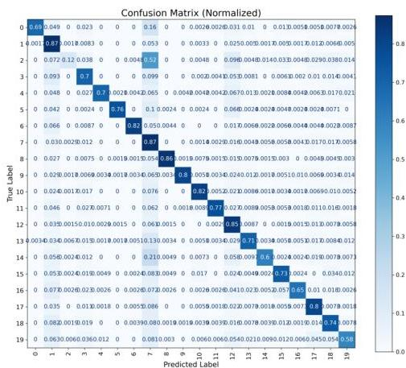
Figure 4: Confusion matrix for CNN+YOLO model

# 5.2.2 End-to-End YOLO Model Customization

In this section, we employ the YOLOv10n model for trash detection, fine-tuned on a custom dataset with tailored hyperparameters. Training was conducted over 50 epochs with a batch size of 16 and an input size of 640, using the AdamW optimizer and a cosine learning rate scheduler for stable and adaptive convergence. Automatic Mixed Precision (AMP) was enabled to enhance training speed and memory efficiency, with a dropout rate of 0.1 to mitigate overfitting. Rectangular training was disabled to ensure uniform batch dimensions, while loss function weights were set to 8 for box loss and 0.6 for classification loss. Early stopping with a patience of 10 epochs was applied to halt training upon performance plateauing, and checkpoints were saved for recovery and evaluation. The fine-tuning process also included a systematic investigation of the effects of freezing various model layers on training outcomes.

# 5.2.3 Evaluation Metrics

To evaluate the detection performance of differently fine-tuned YOLOv10 models on the trash detection task, we used the following detection metrics:

Precision (B): The proportion of correctly detected bounding boxes (objects) among all the predicted bounding boxes by the model.

Recall (B): The proportion of true objects correctly detected.

mAP50 (B): The mean Average Precision at an Intersection over Union (IoU) threshold of 0.50.

mAP50-95 (B): The mean Average Precision averaged across IoU thresholds from 0.50 to 0.95.

# 5.2.4 Fine-Tuning Experimental Results and Insights

|  Config | Precision(B) | Recall(B) | mAP50(B) | mAP50-95(B)  |
| --- | --- | --- | --- | --- |
|  Full Model | 0.962 | 0.876 | 0.927 | 0.827  |
|  Freeze the backbone (layer 0 to 10) | 0.982 | 0.890 | 0.929 | 0.834  |
|  Freeze the head (layer 11 to 23) | 0.489 | 0.640 | 0.583 | 0.493  |
|  Activate layer 7-10 and 23 | 0.976 | 0.894 | 0.932 | 0.836  |

Table 3: Performance metrics of the YOLOv10n model with different configurations during fine-tuning. The table compares precision, recall, mAP50, and mAP50-95 across various configurations, including freezing different layers and partial activation, with (B) indicating bounding box.

The experimental results (Table 3) demonstrate a strong alignment with the architectural principles of the YOLOv10 model discussed in Section 3.2. By selectively activating layers 7-10 and 23, which encompass high-level semantic features and the classification head, we focused on components most responsive to task-specific features. This approach enabled precise predictions while maintaining computational efficiency. Freezing the backbone and fine-tuning the head significantly improved performance, highlighting the backbone's robustness in extracting general features and reducing the risk of overfitting to the dataset. Conversely, freezing the head led to a pronounced decline in performance metrics, underscoring its pivotal role in interpreting and refining features for task-specific predictions. This targeted activation strategy not only enhanced performance but also reduced training time. In addition, the other results are provided in Appendix 5, 6, 7 8.

# 6 Discussion and Next Steps

Our YOLO model with activating layer 7-10 and 23 was the best performing model. The is because our CNN trained on single trash object is bad at identifying overlapping objects. Additionally, activating layer 7-10 and 23 of YOLO that enables precise predictions according to our experiment.

There are several directions to explore for future work. A key next step is testing our algorithms on real-world data to evaluate their robustness. Another promising direction is enhancing the model to recognize the depth ordering of items within images. This capability could enable deploying the algorithm on robotic arms, allowing them to identify trash and determine the optimal order and location for grasping.

7 Contributions

All three group members contributed equally to this project.

- Jenny Chen (jennycjx): Focused on implementing a baseline KNN model for single-object detection and developing the code to generate the multi-object dataset.
- Boyu Han (boyuhan): Focused on training other cnn models (resnet, inception) and finetuning YOLO model
- Coco Xu (cocozxu): Focused on implement custom CNN and transfer learning on single-object detection. Along with the CNN+Bounding Box on multi-object detection.

All members collaboratively contributed to writing the report.

##

# References

[1] Fayeem Aziz, Hamzah Arof, Norrima Mokhtar, Marizan Mubin, and Mohamad Sofian Abu Talip. Rotation invariant bin detection and solid waste level classification. Measurement, 65:19-28, 2015.
[2] Sathish Paulraj Gundupalli, Subrata Hait, and Atul Thakur. Classification of metallic and non-metallic fractions of e-waste using thermal imaging-based technique. *Process Safety and Environmental Protection*, 118:32–39, 2018.
[3] Kaiming He, Xiangyu Zhang, Shaoqing Ren, and Jian Sun. Deep residual learning for image recognition. arXiv:1512.03385, 2015.
[4] Takuya Kiyokawa, Jun Takamatsu, and Shigeki Koyanaka. Challenges for future robotic sorters of mixed industrial waste: A survey. IEEE Transactions on Automation Science and Engineering, 21(1):1023-1040, 2022.
[5] Weisheng Lu and Junjie Chen. Computer vision for solid waste sorting: A critical review of academic research. Waste Management, 142:29-43, 2022.
[6] John Paul Q. Tomas, Marlon Nathan D. Celis, Timothy Kyle B. Chan, and Jethro A. Flores. Trash detection for computer vision using scaled-yolov4 on water surface. In Proceedings of the 11th International Conference on Informatics, Environment, Energy and Applications, pages 1-8, 2022.
[7] Joseph Redmon, Santosh Divvala, Ross Girshick, and Ali Farhadi. You only look once: Unified, real-time object detection. arXiv:1506.02640, 2016.
[8] Affan Shaukat, Yang Gao, Jeffrey A Kuo, Bob A Bowen, and Paul E Mort. Visual classification of waste material for nuclear decommissioning. Robotics and Autonomous Systems, 75:365-378, 2016.
[9] Christian Szegedy, Vincent Vanhoucke, Sergey Ioffe, Jonathon Shlens, and Zbigniew Wojna. Rethinking the inception architecture for computer vision. arXiv:1512.00567, 2015.
[10] Mesut Toğacar, Burhan Ergen, and Zafer Comert. Waste classification using autoencoder network with integrated feature selection method in convolutional neural network models. Measurement, 153:107459, 2020.

# 8 Appendix

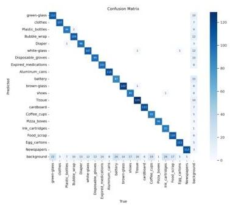
(a) Confusion matrix on 20 categories

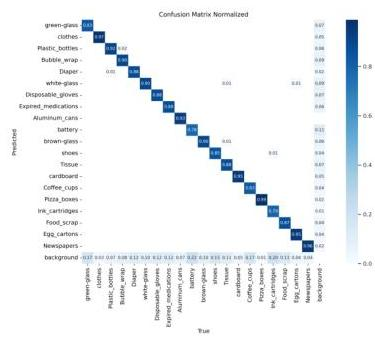
(b) Normalized confusion matrix on 20 categories
Figure 5: The YOLOv10 (full) model demonstrates strong performance across multiple categories, achieving high precision ( $&gt;0.95$ ) in classes such as "clothes", "Pizza boxes" and "Newspapers".

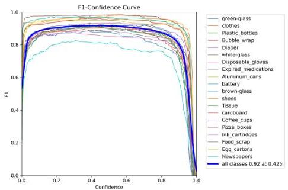
(a) F1-Confidence Curve

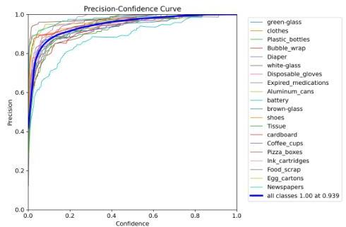
(b) Precision-Confidence Curve

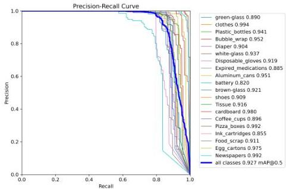
(c) Precision-Recall Curve

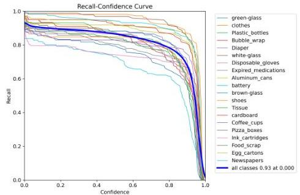
(d) Recall-Confidence Curve
Figure 6: Visualization of performance metrics for the YOLO model across 20 categories. Each curve provides insights into the trade-offs between metrics such as F1, precision, recall, and confidence thresholds, highlighting the model's effectiveness.

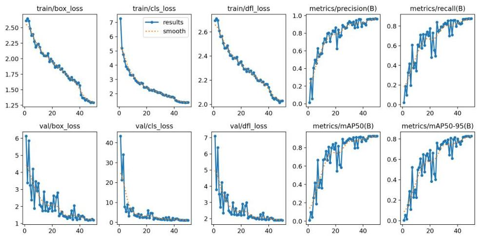
Figure 7: Training and validation results of the YOLO model across 50 epochs. The plots illustrate the progression of key metrics, including training and validation losses (box loss, classification loss, and distribution focal loss) and evaluation metrics (precision, recall, mAP50, and mAP50_95). The dotted orange lines represent smoothed trends for better visualization.

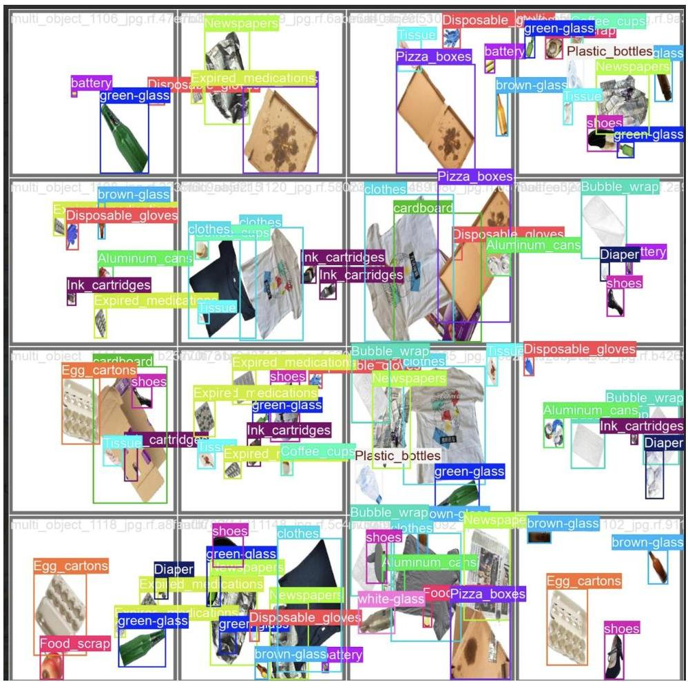
Figure 8: prediction obtained by fine-tuning the full YOLOv10n model.

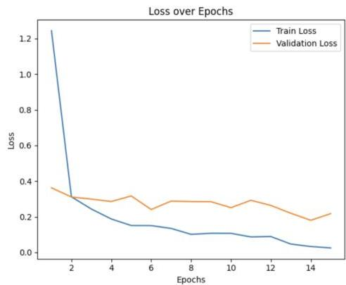
Figure 9: Training and validation results of the CNN model across 15 epochs.

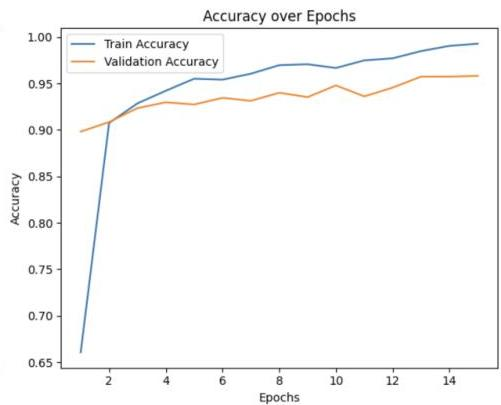

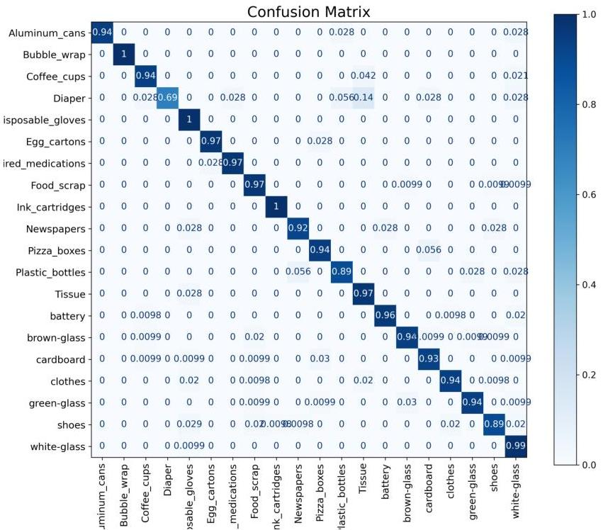
Figure 10: Confusion Matrix for our CNN on single-object

