# Adaptive Dominant Zone Selection in Commercial Buildings Using Machine Learning

Joshua Neutel, Alexis Bonnafont

## Introduction

This work aims to improve the energy efficiency and flexibility of commercial building HVAC systems, which utilize ~6% of US electricity [1, 2] and drive summertime peak load in hot regions like California. The phenomenon explored here applies to a specific type of HVAC system called air handler-variable air volume (AHU-VAV), which serves 12% of commercial buildings in the US and 30% of commercial floor space [3]. Our previous work demonstrates that in AHU-VAV systems, a relatively small number of important rooms (which we call dominant zones) is responsible for driving building-wide cooling load [4]. That few zones drive cooling is important because it implies the majority of energy benefits to be had in efficiency &amp; flexibility programs can be realized while making changes to a small set of zones. Previously, we demonstrated rules of thumb that are more helpful in efficiency contexts, here we explore methods of adaptive dominant zone selection that may be useful in flexibility applications.

A schematic of AHU-VAV systems is provided in the appendix. AHU-VAV systems feature a central air handler that ventilates and cools supply air (a mixture of return air and outside air). Supply air temperature (SAT) is lowered via heat exchange with chilled water, which is paid for as a utility. Supply air is then sent to individual rooms (called zones) via ducts, to be received by variable-air-volume (VAV) control boxes. To keep a zone's temperature (T) below its cooling setpoint (CSP), VAVs can increase the flow rate of air locally via actuating dampers. If a zone exceeds a normalized airflow of 70%-90% (building dependent), in recognition that it is struggling to meet CSP, it will send a "cooling request" to the AHU, asking it to lower its SAT. If the sum of requests exceeds a particular threshold, the AHU will begin to gradually lower its SAT. In previous work, we find that relatively few zones deliver a large majority of cooling requests, and thus few zones (which we call dominant zones) drive AHU DAT down, causing inefficient overcooling in a large majority of zones at minimum airflow (we call these zones dominated).

In this work, we relate zonal dominance to the probability that a zone will send a cooling request tomorrow. We do so using a family of logistic regression models - one for each zone - where the inputs to each model are daily updating zone-level data (such as temperature, CSPs, cooling requests, etc), and the output is the probability of a zone sending a cooling request the next day.

## Related Work

Historically, dominant zones have been flagged with rules of thumb. For example, in our previous work, we use analyses like that shown in Figure 1 to identify dominant zones. Here we plot for eight buildings at Stanford, each zone's average time spent sending a request versus its average T - CSP over the Summer of 2023. We flag zones that spend ≥ 5% of their time sending a cooling request. These zones are also typically near their CSP on average.

The American Society of Heating, Refrigeration, and Air-Conditioning Engineers (ASHRAE), a professional association that publishes guidelines for HVAC design and control, is more conservative in its recommendation, suggesting to flag zones as dominant if they spend 70% of their time or more sending a cooling request [5]. By this definition, 23 of 1191 zones would be flagged as dominant across the eight buildings studied here (as opposed to 209 flagged below). Dominant zone detection is generally an underpublished area, however, there are some examples of other researchers flagging dominant zones as part of their work (Torabi et al. [6], Raftery et al [7]); in these cases, researchers typically follow standard ASHRAE guidelines.

Traditional methods of dominant zone detection have the advantage of being easy to understand and implement, however, they have two major disadvantages: 1) they rely on arbitrary thresholding - for example, note the disagreement between our previous work and ASHRAE guidelines, and 2) they cannot easily account for the fact that dominance may change over time (on the order of both days and weeks) due to changes in weather or occupancy, or because of mechanical/digital failures that emerge. These deficiencies are less harmful in energy efficiency contexts, where commissioning engineers may select the most dominant zones once and then apply energy upgrades to those zones over the course of a few weeks.

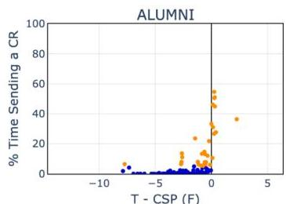

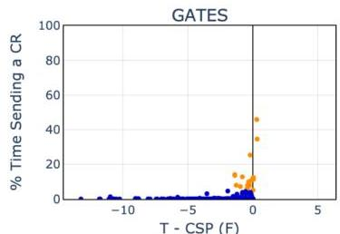

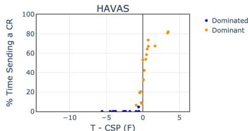

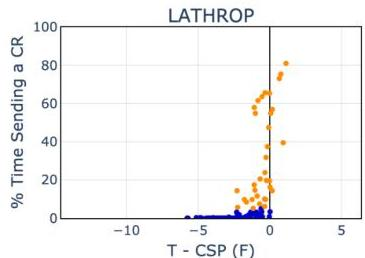

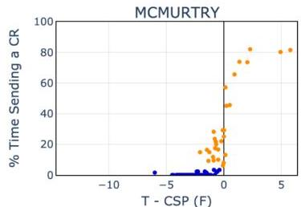

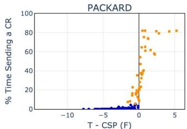

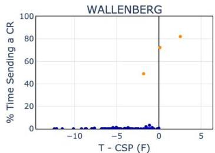
Figure 1: Fraction of time sending a cooling request vs  $T$ -CSP, Summer 2023 data. Each data point is a zone.

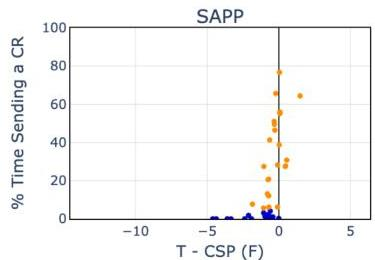

In the context of commercial HVAC systems, one energy flexibility strategy involves increasing CSPs to reduce building-wide cooling load. This is a temporary relief measure to reduce consumption for a day or two, during emergency scenarios like heat waves. We did exactly this in our previous work [8], and demonstrated  $13\% - 28\%$  reductions in load (building dependent) by increasing CSPs in all zones. Increasing CSPs in dominant zones only poses risk in this context, where guaranteed single-day load reductions are critical. At the same time, the ability to increase CSPs in dominant zones only would make demand response more palatable for building managers, who are often concerned with occupant comfort. These constraints motivate us to develop a more advanced method of dominant zone detection that can identify dominant zones with higher precision while maintaining zonal selectivity.

# Dataset

This work utilizes a unique and private dataset that was gathered by our research group. We collected the data in partnership with Stanford's Land Building and Real Estate (LBRE) organization, which manages the commercial buildings on Stanford's campus. The data was gathered via a tool we have built over several years which can scrape data from Stanford's HVAC systems. In this work, we utilize data from eight buildings, which in total have 31 AHUs and 1208 zones. For each AHU and zone, we have access to several sensor measurements (e.g. temperature, airflow), however here we only consider a few we know to be particularly relevant. The dataset covers the period of May 1st - September 30th, 2023 at an hourly time interval, however, in this work we often summarize to a daily time step. We also focus only on business hours (defined here as Monday-Friday from 9 AM - 6 PM) because commercial buildings often operate fundamentally differently during non-business hours.

We split our dataset by zone for evaluation and testing purposes. In particular, we hold out  $25\%$  of zones for each building and then apply the day-ahead procedure described below, testing several features and a key hyperparameter. We then fix features/hyperparameters and apply the same day-ahead procedure to the test set.

# Methods

We frame the learning problem as a task in estimating the probability that a zone will send a cooling request tomorrow. We do so using logistic regression, with each zone getting its own model. The index of each design

matrix is days, and the columns are rolling averages of zone-level data. The rolling averages give the model some sense of short, medium, and/or long-term memory regarding the behavior of each zone, which it can use to estimate the probability of sending a cooling request the next day. The y-labels are binary indicating whether or not a zone sent a cooling request on a particular day. To simulate how this model would be applied in practice, we purposefully withhold information from the model, feeding it one new day (row) of data at a time. At each time step, we train on all prior days and project forward one day. Table 1 shows an example X-matrix and y-vector for VAV 3-184 in the Gates building for weekdays between June 9th - June 13th, 2023.

|   | T - CSP, Past 1 Days | T - CSP, Past 30 Days | Intercept  |
| --- | --- | --- | --- |
|  6/9/2023 | -0.65 | -1.29 | 1.00  |
|  6/12/2023 | -1.27 | -1.29 | 1.00  |
|  6/13/2023 | -0.24 | -1.25 | 1.00  |
|   | Sent Cooling Request  |
| --- | --- |
|  6/9/2023 | 0  |
|  6/12/2023 | 0  |
|  6/13/2023 | 1  |

Table 1: Example X-matrix for and y-vector. Shown for VAV 3-184 in the Gates building from June 9-13, 2023

# Results: Validation Set

In our case, choosing a feature implies selecting a time window and a variable. For the prior, we consider the following windows, in isolation and combination: 1, 5, 10, and 30 days. These windows were selected as reasonable proxies for short, medium, and long-term memory. For the latter, mainly three variables were considered: T - CSP, normalized airflow, and the fraction of time spent sending a request (historically). Zones that are closer to setpoint, have high airflow, and/or spend more time sending a request (historically) should be more likely to send requests in the future. We also consider one "external" feature, outside air temperature (OAT), with the idea that requests should be more likely on hot days. In addition to feature selection, we use the validation set to choose an important hyperparameter: the probability threshold with which to predict a cooling request. We can set the probability threshold  $&lt; 0.5$  to adjust for the fact that missing a cooling request is more painful than projecting one in error.

While additional testing was done, we report on feature combinations described below. For each combination, we test the following probability thresholds: 0, 0.01, 0.05, 0.1, 0.2, 0.3, 0.4, 0.5, 0.75, and 1.

-  $T - CSP1\_30$ : T - CSP using 1 and 30-day windows
-  $T - CSP1\_5\_10\_30$ : T - CSP using 1, 5, 10, and 30-day windows
- Airflow: normalized airflow using 1, 5, 10, and 30-day windows
- CRs: Fraction of time spent sending a cooling request, using 1, 5, 10, and 30-day windows
-  $T - CSP$  &amp; Airflow &amp; CRs &amp; OAT: prior three in combination, and an OAT feature.

Results are summarized in Figure 2, which plots for each building recall (fraction of requests that are predicted as requests) versus the average (over the modeled period) fraction of zones that are flagged as dominant. In the figure, each curve corresponds to a feature combination, and each point corresponds to a probability threshold. The test error on the validation set is shown in solid lines and the training error in dashed lines. Finally, we plot a benchmark that is calculated using the dominant zone selections shown in Figure 1.

As the probability threshold is reduced left-to-right, it becomes easier to predict a cooling request and so recall improves, but at the expense of more zones being flagged as dominant. In this way, the probability threshold lends itself to a natural means of weighing risk (requests) vs. benefit (reducing project scope). The shape of each curve speaks to the extent to which the dominant zone concept applies to each building; for example, the steep slope in Gates implies a small portion of zones accounts for a large portion of cooling requests, as opposed to SAPP where this effect is less extreme. For the test set, a probability threshold is chosen for each building (listed in appendix) so that we lie near the "elbow" of each curve - the point where adding zones results in marginally better performance.

A striking quality of Figure 2 is that many of the curves lie close to one another, and most sit above the benchmark. The implication is that all features tested perform relatively well. Overall, "T - CSP" performs slightly better than "Airflow" and "CRs". Stacking features leads to slightly worse performance (overfit), likely because the features explored are well correlated. Similarly, adding additional time windows does not improve performance (see

"T - CSP 1_30" is often directly below "T - CSP 1_5_10_30"), again because of correlation between features. For the test set, we opt to go with a very simple set of features, being just T - CSP with 1 and 30-day windows.

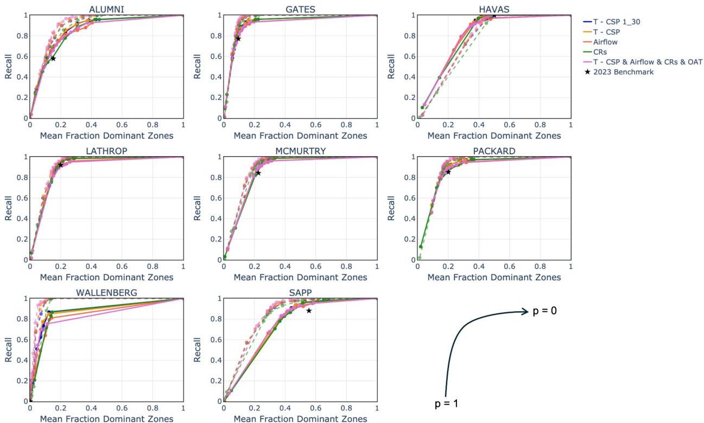
Figure 2: Results of model tuning.

# Results: Test Set

Confusion matrices for the logistic models and the benchmark are provided below in Table 2, summed across all buildings, zones, and days. The confusion matrices consider each zone-day (each opportunity for a request) as a sample. The logistic models exhibit better recall (93% vs. 75%) while also flagging roughly the same fraction of zones as dominant on average (23%) over the studied period. Per building matrices are provided in the appendix.

Logistic Models

|   |  | Prediction  |   |
| --- | --- | --- | --- |
|  Actual |  | 0 | 1  |
|   |  0 | 55,869 | 7,174  |
|   |  1 | 688 | 9,611  |

Benchmark

|   |  | Prediction  |   |
| --- | --- | --- | --- |
|  Actual |  | 0 | 1  |
|   |  0 | 53,611 | 9,432  |
|   |  1 | 2,586 | 7,713  |

Table 2: Test-set confusion matrices summed across all zone-days, for the logistic models (left) &amp; benchmark (right)

In Figure 3, we show how the logistic models and benchmarks perform over time for each building. In the figure, the fraction of zones flagged as dominant is shown in blue, whereas the fraction of cooling requests missed is shown in red, for the logistic models in solid lines and the benchmark in dashed lines. As can be seen, the benchmark uses a stagnant selection of dominant zones, with the fraction of zones (blue dashed line) being constant over time. By comparison, the logistic model can update the fraction of zones over time (blue solid line), particularly evident in some buildings (Alumni, Havas, SAPP) where the model chooses to flag more zones during hotter months. This results in improved recall over time, with red solid lines generally being below red dashed lines.

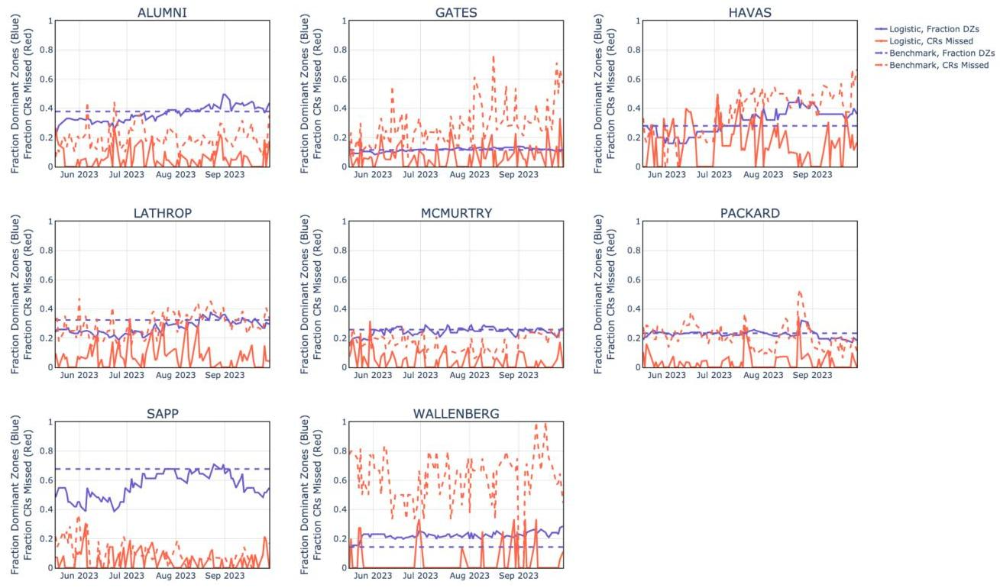
Figure 3: Results over time on the test set

In Figure 4, we show detailed examples exhibiting model behavior for two zones in the Gates building, VAV 1-119-A and VAV 1-451-C, for which separate logistic models scored a recall of  $0\%$  and  $100\%$  respectively. In the figure, we plot the estimated probability of a cooling request, Gate's probability threshold (0.1), T - CSP which the model uses to create its features, and whether or not a request is sent. Many zones that score low recall look similar to VAV 1-119-A, which has a few "random" requests but is not dominant in the sense that it does not send requests persistently. Notice that for VAV 1-451C, the model dynamically lowers the probability of cooling request when the zone's temperature retreats from its setpoint in August, and then restores the probability when room temperature increases again in September.

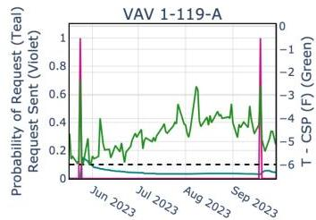
Figure 4: Examples of logistic models working

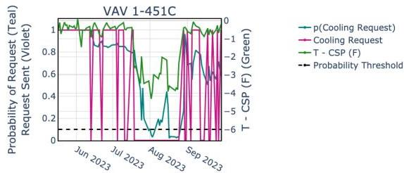

# Conclusion &amp; Future Work

In this work, we demonstrate a logistic regression framework that relates zonal dominance to the probability of sending a cooling request tomorrow. While several features were attempted, models that utilize T - CSP with 1 and 30-day averages work well, with one model per zone. The logistic models score higher recall than standard rules-of-thumb while selecting a similar number of zones. We attribute improved performance to more optimal thresholding and to the logistic model's ability to change selections over time. The success of the model potentially opens the door to flexibility programs that target dominant zones only. In future work, we would like to explore whether rapid changes in request probability can be used as a fault detection algorithm, which alerts operators of failures that result in important behavior changes (i.e., a zone moving from dominated to dominant).

# Contributions

Both Josh and Alexis took a strong part in developing the model shown. The idea originated from Josh's PhD research, and Josh/Alexis both refined the concept together. Alexis took first lead in developing a scalable code structure, and then Josh refined it and developed the day-ahead simulator described, including the validation/test procedure. Josh wrote the first draft of the report and then Alexis edited it. Alexis is also leading the poster, and Josh will have an editing role there.

# References

[1] Statista Research Department, "Electricity consumption in the US from 2016 to 2022, by sector", 2024.
[2] US Energy Information Administration (EIA), "Peak hourly U.S. electricity demand in July was the second highest since 2016," 2023.
[3] US Energy Administration (EUA), "Commercial Buildings Energy Consumption Survey. Table B1: Summary table: total and means of floorspace, number of workers, and hours of operation, 2018," 2018
[4] J. Neutel, C. McMahon, T. Troxell, A. Bonnafont, S. Benson, and J. de Chalendar, “Empirical evidence of dominant zones: Few zones drive cooling savings in setpoint experiments”, 2025 (in process)
[5] ASHRAE, "ASHRAE Guideline 36-2021: High-Performance Sequences of Operations for HAVC Systems," 2021
[6] N. Torabi, H. Gunay, and W. O'Brien, “A simulation-based investigation of the robustness of sequences of operation to zone-level faults in single-duct multi-zone variable air volume air handling unit systems”, 2024
[7] P. Raftery, H. Cheng, R. Singla, T. Peffer, D. Vernon, C. Duarte, E. Lamon, R. McMurry, G. Paliaga, M. Thawer, P. Wendler, “Reducing Gas Consumption in Existing Large Commercial Buildings”, 2024
[8] J. de Chalendar, C. McMahon, L. Valenzuela, P. Glynn, S. Benson, “Unlocking demand response in commercial buildings: Empirical response of commercial buildings to daily cooling setpoint adjustments”, 2023

# Appendix

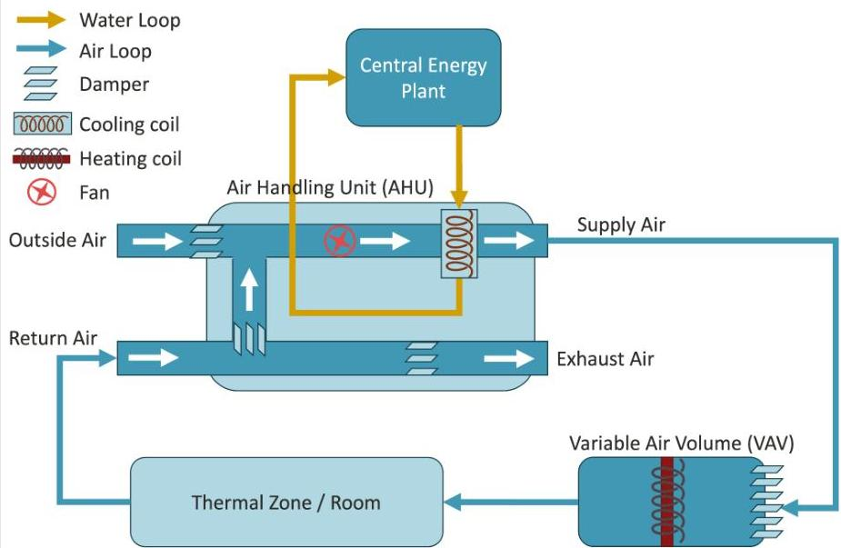
Figure A1: Schematic illustrating AHU-VAV systems.

|   | Probability Threshold  |
| --- | --- |
|  ALUMNI | 0.10  |
|  GATES | 0.10  |
|  HAVAS | 0.50  |
|  LATHROP | 0.20  |
|  MCMURTRY | 0.20  |
|  PACKARD | 0.15  |
|  WALLENBERG | 0.01  |
|  SAPP | 0.20  |

Table A1: Probability thresholds chosen for each building

Alumni

Logistic Models

|   |  | Prediction  |   |
| --- | --- | --- | --- |
|  Actual |  | 0 | 1  |
|   |  0 | 5,295 | 1,553  |
|   |  1 | 101 | 1,497  |

Benchmark

|   |  | Prediction  |   |
| --- | --- | --- | --- |
|  Actual |  | 0 | 1  |
|   |  0 | 4,926 | 1,922  |
|   |  1 | 322 | 1,276  |

Gates

Logistic Models

|   |  | Prediction  |   |
| --- | --- | --- | --- |
|  Actual |  | 0 | 1  |
|   |  0 | 20,723 | 1,432  |
|   |  1 | 103 | 1,276  |

Benchmark

|   |  | Prediction  |   |
| --- | --- | --- | --- |
|  Actual |  | 0 | 1  |
|   |  0 | 20,447 | 1,708  |
|   |  1 | 381 | 998  |

Havas

Logistic Models

|   |  | Prediction  |   |
| --- | --- | --- | --- |
|  Actual |  | 0 | 1  |
|   |  0 | 1,314 | 83  |
|   |  1 | 107 | 546  |

Benchmark

|   |  | Prediction  |   |
| --- | --- | --- | --- |
|  Actual |  | 0 | 1  |
|   |  0 | 1,212 | 185  |
|   |  1 | 264 | 389  |

Lathrop

Logistic Models

|   |  | Prediction  |   |
| --- | --- | --- | --- |
|  Actual |  | 0 | 1  |
|   |  0 | 6,290 | 857  |
|   |  1 | 132 | 1,577  |

Benchmark

|   |  | Prediction  |   |
| --- | --- | --- | --- |
|  Actual |  | 0 | 1  |
|   |  0 | 5,453 | 1,694  |
|   |  1 | 533 | 1,176  |

McMurtry

Logistic Models

|   |  | Prediction  |   |
| --- | --- | --- | --- |
|  Actual |  | 0 | 1  |
|   |  0 | 5,941 | 508  |
|   |  1 | 74 | 1,431  |

Benchmark

|   |  | Prediction  |   |
| --- | --- | --- | --- |
|  Actual |  | 0 | 1  |
|   |  0 | 5,662 | 787  |
|   |  1 | 242 | 1,263  |

Packard

Logistic Models

|   |  | Prediction  |   |
| --- | --- | --- | --- |
|  Actual |  | 0 | 1  |
|   |  0 | 9,656 | 1,027  |
|   |  1 | 90 | 1,927  |

Benchmark

|   |  | Prediction  |   |
| --- | --- | --- | --- |
|  Actual |  | 0 | 1  |
|   |  0 | 9,233 | 1,450  |
|   |  1 | 459 | 1,558  |

Wallenberg

Logistic Models

|   |  | Prediction  |   |
| --- | --- | --- | --- |
|  Actual |  | 0 | 1  |
|   |  0 | 5,604 | 1,225  |
|   |  1 | 23 | 414  |

Benchmark

|   |  | Prediction  |   |
| --- | --- | --- | --- |
|  Actual |  | 0 | 1  |
|   |  0 | 5,967 | 862  |
|   |  1 | 282 | 155  |

SAPP

Logistic Models

|   |  | Prediction  |   |
| --- | --- | --- | --- |
|  Actual |  | 0 | 1  |
|   |  0 | 1,046 | 489  |
|   |  1 | 58 | 943  |

Benchmark

|   |  | Prediction  |   |
| --- | --- | --- | --- |
|  Actual |  | 0 | 1  |
|   |  0 | 711 | 824  |
|   |  1 | 103 | 898  |

Table A2: Test-set confusion matrices for each building, summed across zone-days, for the logistic models (left) &amp; benchmark (right)

