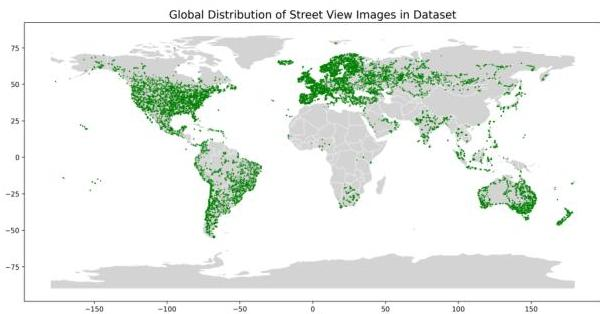
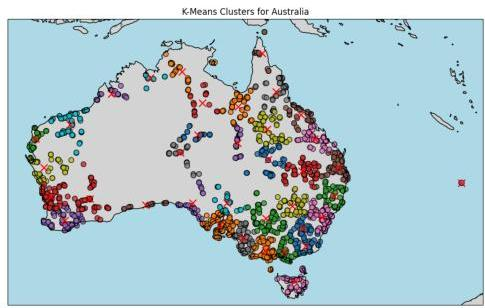
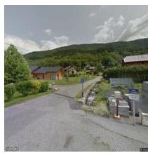
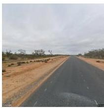
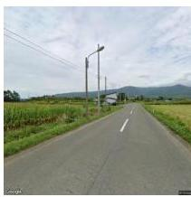
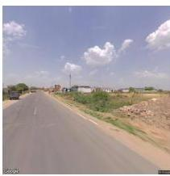
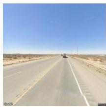
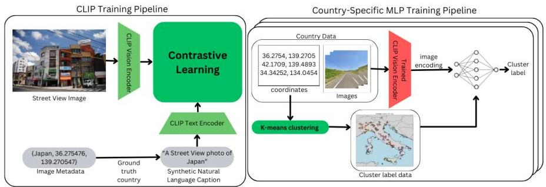
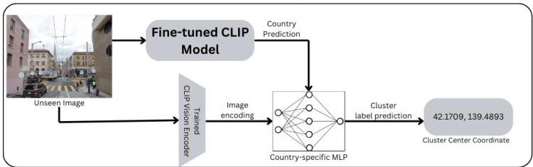
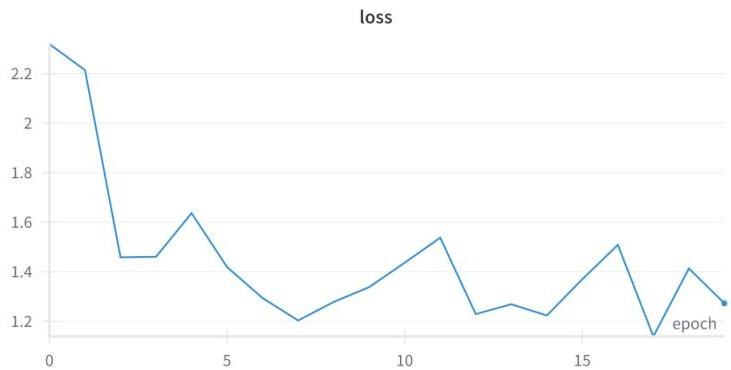

# "From Clues to Coordinates": Predicting Locations from Google Street View Images

Viraj Jayam
Department of Computer Science
Stanford University
veejay99@stanford.edu
&Kapil Dheeriya
Department of Electrical Engineering
Stanford University
kapd@stanford.edu

###### Abstract

Image geolocation is the difficult problem of predicting the geographic location at which a photo was taken. In this project, we develop a two stage model that predicts the country and geographic coordinates of Google Street View images. First, we leverage contrastive learning to classify images by country using a fine-tuned CLIP model. Second, we geographically cluster our datapoints and train a multilayer perceptron (MLP) for each country to predict most likely picture of a test image. With this novel procedure, our model achieves robust performance at both country and coordinate-level predictions. The work demonstrates the potential of combining large language-vision models with domain-specific learning to solve real-world geolocation tasks.

## 1 Introduction

The ability to geolocate an image—to determine its geographic origin from visual data alone—is an exciting and challenging problem in computer vision. The geolocation problem is complex - it requires identifying subtle visual cues and contextualizing them with global knowledge of architectural styles, road markings, languages, signs, and vegetation. As avid enthusiasts of the online geography game Geoguessr, which challenges players to identify locations from Google Street View images, we wanted to leverage machine learning techniques to outperform human players at Google Street View geolocation. Beyond the game Geoguessr, this task has practical applications in open-source intelligence, investigative journalism, environmental monitoring, and autonomous vehicle navigation.

In this project, we address the problem of geolocating Google Street View images by building a two-stage machine learning model. Our first task is to predict the country where a given image was captured, which we achieve by fine-tuning OpenAI’s CLIP model. CLIP is a multimodal model that processes text and image pairs, and we leverage its capabilities by training it with synthetic natural language captions such as “This is a streetview image of [country].” This approach allows the model to perform zero-shot country classification while benefiting from contrastive learning.

The second stage focuses on fine-grained geolocation within each country. Because precise coordinate prediction with a regressor head is too high variance of an approach, we sought after a smarter way of classifying into a region. For this, we first geographically cluster our datapoints into regions. Then, we trained a multilayer perceptron (MLP) to classify which region a test image would fall into. The final coordinate prediction would be the center of the region.

The significance of this work lies in its ability to bridge coarse-grained classification (country-level) and fine-grained regression (coordinate-level) in a cohesive framework. By combining a pre-trained vision-language model with a novel clustering mechanism, our approach demonstrates good performance on the geolocation task. This project not only extends the utility of CLIP to geolocation but also provides a modular architecture that could be applied to broader tasks requiring hierarchical classification and regression.

# 2 Related Work

The first attempt at global geolocation was by *Hays and Efros (2008)*, who used the k-nearest neighbor algorithm on a dataset of six million geotagged images to perform image matching for geolocation.

Subsequent global geolocation efforts focused on classification. These methods gridded the world map into cells then outputted a probability distribution over the cells given an image. *Weyand et al. (2016)* first used a single convolutional neural network *Krizhevsky et al. (2012)* to classify images into these geographical cells. Classification for geolocation then shifted toward using vision transformers, as in the TransLocator model in *Pramanick et al. (2022)*. Although these classification models had impressive performance, each geographical cell is treated as a categorical variable, obscuring any spatial relationships between cells, i.e. neighboring cells are treated no differently than distant cells. Instead of cells, we opted to classify on clusters within a country using MLPs.

The most recent, state-of-the-art models rely on multi-modal learning by combining computer vision and natural language captions for geolocation using the contrastive language image pre-training (CLIP) model introduced in *Radford et al. (2021)*, in which text and image encoders are trained concurrently using contrastive learning. These models extend CLIP’s zero-shot learning capabilities to image geolocation by incorporating synthetic caption pretraining. The first such use of CLIP for zero-shot geolocation via linear probing was demonstrated by *Wu and Huang (2022)* in their IM2City model, which trained on city-only street view images to make city level predictions among 56 major cities. Stanford researchers improved on IM2City with the StreetCLIP model in *Haas et al. (2023)* by including the city, region, and country in their synthetic captions for pretraining CLIP. The clever innovation in StreetCLIP was to use hierarchical linear probing for inference, first generating a zero-shot learner to predict the country, then generating another zero-shot learner to guess the city among the 30 most populous cities within that country.

Our approach is similar to the StreetCLIP method in that we pretrain CLIP on a global dataset of street view images with synthetic captions that include the country. It differs in that once our model predicts a country, we use k-means and MLPs to predict a coordinate within a country.

## 3 Dataset and Features

(a) Street view image dataset distribution

(b) Australia images clustered via k-means

As there are no publicly available street view image datasets that have comprehensive global coverage, we generated our own dataset of street view images across all 140 countries and island territories with street view coverage. Each datapoint contains {street view image, country, latitude, longitude}. To scrape street view images, we first looped through every country and tiled it with 50 km squares. We then randomly sampled a number of tiles proportional to the land area of the country (1 tile per 10,000 km^{2}). For each tile, we extract the road network graph from the OpenStreetMap API and randomly sample five points on the road network. We then call the Street View API to extract the 640x640 pixel street view images associated with each coordinate. This method ensured uniform sampling across all street view coverage. We collected 22,390 images and used an 80/10/10 split for our training, validation, and test sets. The distribution of our images closely matches the true distribution of all street view images.

(a) France

(b) Australia

(c) Japan

(d) Image 4
Figure 2: Five Street View images from our dataset.

(e) Image 5

# 4 Methods

For hierarchical prediction of the location of a street view image, our model consists of two stages. The first stage is a fine-tuned CLIP model to predict the country associated with a street view image. The second stage is a set of multi-layer perceptrons (MLPs), one for each country, to guess a coordinate within the country predicted by the CLIP model.

Model Training Pipeline

Inference Pipeline
Figure 3: Training and inference pipelines for our model.

# 4.1 CLIP Country Prediction

In the first stage, we run generalized zero-shot learning to classify street view photos by country via softmax. We start with the weights initialized to the OpenAI pre-trained CLIP model. We then pretrain by creating a synthetic natural language caption of the image from the metadata. This synthetic caption takes the form "A Street View photo in [country]." We then train the new CLIP model using the street view images and their associated natural language captions. The model leverages these natural language inputs during training to generate better zero-shot learners than just the images and metadata alone. The loss function for the CLIP model is given by

$$
\mathcal {L} _ {\mathrm {C L I P}} = 0. 5 \cdot \left(\mathcal {L} _ {\mathrm {T e x t}} + \mathcal {L} _ {\mathrm {I m a g e s}}\right)
$$

where the two individual cross entropy terms  $\mathcal{L}_{\mathrm{Text}}$  and  $\mathcal{L}_{\mathrm{Images}}$  are the softmaxes over the dimensions of the text and image embeddings of the matrix product of the text and image embeddings (Radford

et al., 2021)*. We use the AdamW optimizer with batch stochastic gradient descent to run supervised training of the text encoder, image encoder, and contrastive learning within the CLIP model. Here’s the explanation without rendering the LaTeX code:

During inference, CLIP functions as a zero-shot classifier by synthesizing a linear classifier for a given image. Consider an image $v\in V$ and a set of $N$ natural language captions $x\in X$, structured using the template “A Street View photo in {country}.” These inputs are processed through CLIP’s image encoder $\mathbf{v}=g(v)$ and text encoder $\mathbf{X}=f(x)$, producing $\mathbf{v}\in\mathbb{R}^{d\times 1}$ and $\mathbf{X}\in\mathbb{R}^{N\times d}$, where $d$ is the dimension of the shared embedding space. Each row of $\mathbf{X}$ encodes the semantic meaning of a specific {country}.

CLIP then constructs a linear classifier $h(\mathbf{v};\mathbf{X})$ that computes the probability distribution over the country caption representations by applying a softmax to the matrix-vector product $\mathbf{X}\mathbf{v}$:

$h(\mathbf{v};\mathbf{X})=\frac{\exp\left(\mathbf{X}\mathbf{v}\right)}{\sum_{j=1}^{N}\exp\left(\mathbf{X}_{j}^{T}\mathbf{v}\right)}$

Here, $h(\mathbf{v})$ outputs a probability vector where each entry corresponds to the likelihood of the image belonging to a particular country, and we predict the most likely country.

### 4.2 $k$-means clustering and MLP for coordinate prediction

In the second stage, we first run the $k$-means clustering algorithm for the coordinates of the test images within each country so we can use the resulting cluster centroids as our coordinate predictions. For each country, $k=n_{images}/20$. The $k$-means clustering algorithm is as follows (Ng):

1. Initialize cluster centroids $\mu_{1},\mu_{2},\ldots,\mu_{k}\in\mathbb{R}^{2}$ randomly.
2. Repeat until convergence:

- For every $i$, set

$c^{(i)}:=\arg\min_{j}\|x^{(i)}-\mu_{j}\|^{2}.$
- For each $j$, set

$\mu_{j}:=\frac{\sum_{i=1}^{n}\mathbf{1}\{c^{(i)}=j\}x^{(i)}}{\sum_{i=1}^{n}\mathbf{1}\{c^{(i)}=j\}}.$

With each image assigned to a cluster within a country, we can then train a separate MLP for each country with more than one cluster (36 countries) to predict the cluster to which a given image will belong. We use our previously trained CLIP model vision encoder to encode our images to be inputted into a country’s MLP. For training, we use cross-entropy as our loss function for the MLPs.

To predict a coordinate from a given image during inference, we first predict the country using our fine-tuned CLIP model. We input the image encoding into the MLP associated with the predicted country to predict a cluster for the image. Our final guess for the coordinate of the image is the cluster centroid coordinate.

## 5 Experiments / Results / Discussion

Our main metric in testing all of our models was test accuracy. When testing the model end-to-end, we used the Haversine function (spherical coordinates formula) to calculate the distance between our predicted coordinates and the ground truth coordinates. We ran a training, test, and validation set using our own dataset of 22,390 streetview images. For training CLIP we chose a batch size = 64, learning rate = 1e-5, and 20 epochs. For training MLPs we chose a batch size = 1, learning rate = 1e-6, and 10 epochs. The MLPs have three fully connected layers, with input dimension of $512$, hidden dimension of $128$, and nodes equipped with the ReLU activation function.

We benchmarked our model against the test datasets IM2GPS and IM2GPS3K commonly used in the geolocation literature. These images contain a variety of content and location and are very

Table 1: Evaluation of Model on Open-Domain Image Geolocation Benchmarks

|  Benchmark | Model | City 25km | Region 200km | Country 750km | Continent 2,500km  |
| --- | --- | --- | --- | --- | --- |
|  IM2GPS n = 237 | PlaNet (Weyand et al., 2016) | 24.5 | 37.6 | 53.6 | 71.3  |
|   |  ISNs (Müller-Budack et al., 2018) | 43.0 | 51.9 | 66.7 | 80.2  |
|   |  TransLocator (Pramanick et al., 2022) | 48.1 | 64.6 | 75.6 | 86.7  |
|   |  StreetCLIP | 28.3 | 45.1 | 74.7 | 88.2  |
|   |  Our model | 5.1 | 35.2 | 56.7 | 70.3  |
|  IM2GPS3K n = 2997 | PlaNet (Weyand et al., 2016) | 24.8 | 34.3 | 48.4 | 64.6  |
|   |  ISNs (Müller-Budack et al., 2018) | 28.0 | 36.6 | 49.7 | 66.0  |
|   |  TransLocator (Pramanick et al., 2022) | 31.1 | 46.7 | 58.9 | 80.1  |
|   |  StreetCLIP | 22.4 | 37.4 | 61.3 | 80.4  |
|   |  Our model | 6.5 | 29.1 | 51.4 | 65.9  |

Figure 4: CLIP training loss vs. Epoch

different from street view images, allowing us to test out-of-distribution performance and compare to foundational geolocation models. Our performance on these datasets suffered, however, because we trained only on street view images.

# 6 Conclusion / Future Work

In our paper, we investigated a novel method of geolocation that has a more improved synthetic natural language caption along with a better finegrained training pipeline. Unlike our competitors at StreetCLIP, we do not rely on CLIP for finegraining our task. We believe that the country-based CLIP architecture was very good, as the natural language captions were short and straightforward, which allowed better accuracy.

Unfortunately however, we were limited with our dataset. Due to the cost of sourcing data from the StreetView API, we were not able to train on enough data. We believe that the overall performance of our model was hindered by this fact. Feeding the image encodings from the CLIP-ViT was a simple idea in our pipeline. We may be able to use self-attention to make more interesting features to feed into the multilayer attention. With more compute resources, the model will be able to pick up on more and more intricacies. Additionally, we can choose a larger number of clusters with more training points per cluster, which would be very helpful for the precision of our prediction.

# 7 Contributions

All contributions in this project are equal between the authors.

References

Lukas Haas, Silas Alberti, and Michal Skreta. 2023. Learning generalized zero-shot learners for open-domain image geolocalization.

James Hays and Alexei A. Efros. 2008. Im2gps: estimating geographic information from a single image. In 2008 IEEE Conference on Computer Vision and Pattern Recognition, pages 1–8.

Alex Krizhevsky, Ilya Sutskever, and Geoffrey E Hinton. 2012. Imagenet classification with deep convolutional neural networks. In Advances in Neural Information Processing Systems, volume 25. Curran Associates, Inc.

Andrew Ng. [link].

Shraman Pramanick, Ewa M. Nowara, Joshua Gleason, Carlos D. Castillo, and Rama Chellappa. 2022. Where in the world is this image? transformer-based geo-localization in the wild. In Computer Vision – ECCV 2022, pages 196–215, Cham. Springer Nature Switzerland.

Alec Radford, Jong Wook Kim, Chris Hallacy, Aditya Ramesh, Gabriel Goh, Sandhini Agarwal, Girish Sastry, Amanda Askell, Pamela Mishkin, Jack Clark, Gretchen Krueger, and Ilya Sutskever. 2021. Learning transferable visual models from natural language supervision.

Tobias Weyand, Ilya Kostrikov, and James Philbin. 2016. PlaNet - Photo Geolocation with Convolutional Neural Networks. Springer International Publishing.

Meiliu Wu and Qunying Huang. 2022. Im2city: image geo-localization via multi-modal learning. In Proceedings of the 5th ACM SIGSPATIAL International Workshop on AI for Geographic Knowledge Discovery, GeoAI 2022, Seattle, Washington, 1 November 2022, pages 50–61. ACM.

