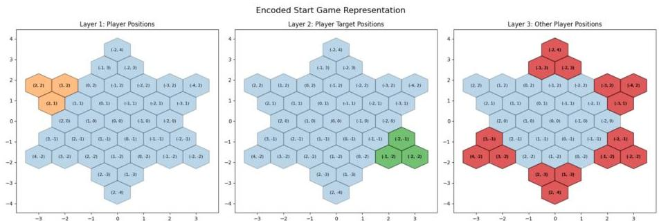
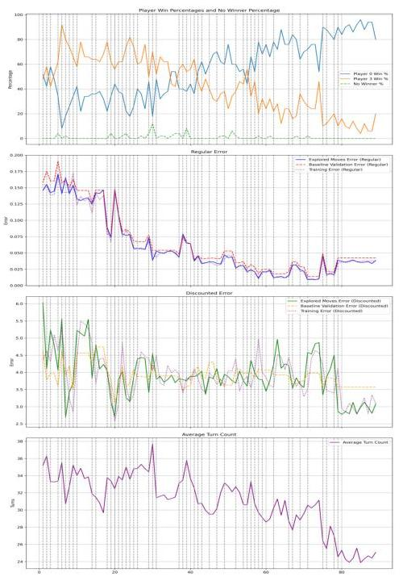
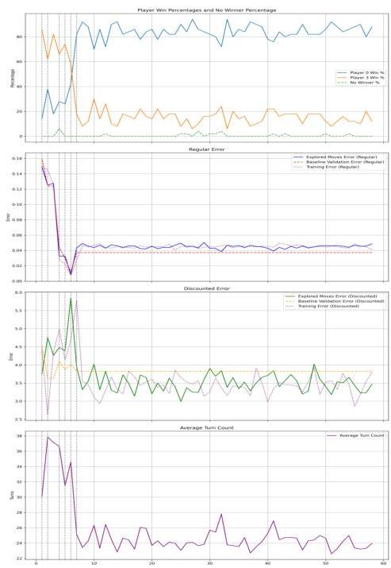

# Generalization of DQL Strategies in Multi-Player Chinese Checkers

Stanford CS229 Project

Dakota Parker
Department of Computer Science
Stanford University
dakotajp@stanford.edu

## 1 Introduction

Deep reinforcement learning models often struggle to generalize beyond the settings in which they are trained *(Cobbe et al., 2018)*. We investigate how a deep Q-learning (DQL) agent, trained in a 2-player Chinese Checkers scenario, adapts to 3-, 4-, and 6-player versions. This approach explores cost-effective methods to scale strategies learned in simpler settings to more complex multi-agent environments.

Chinese Checkers is a simple game where players move pegs across a board toward a target position. The first player to move all their pieces to the target wins. This environment is ideal for studying generalizability due to minimal rule changes across games of 2, 3, 4, or 6 players.

Our model encodes board states and candidate moves into spatial grids processed by convolutional neural networks (CNNs), producing features passed to a DQN for action-value estimation. We benchmark against a heuristic baseline prioritizing forward progress to assess how well learned policies transfer and adapt as opponents increase.

## 2 Related Work

Deep Q-networks (DQNs), combined with convolutional neural networks (CNNs), first demonstrated the potential of processing high-dimensional inputs to achieve near-human-level performance in single-agent environments *(Mnih et al., 2013)*. However, these early methods focused exclusively on single-agent tasks. Later work addressed generalization challenges in reinforcement learning (RL), showing that models often struggle to adapt to unseen environments *(Cobbe et al., 2018)*. This motivated research into robust RL approaches capable of scaling across more complex tasks.

In multi-agent environments, parameter-sharing architectures have proven effective, enabling agents to learn cooperative or competitive strategies in a resource-efficient manner *(Adhikari and Gu, 2024)*. Surveys of multi-agent RL emphasize the challenges of larger action spaces and the dynamic interactions between agents, which require novel strategies for stable learning *(Hernandez-Leal et al., 2019)*. Additionally, Monte Carlo tree search (MCTS), when combined with deep RL, has achieved superhuman performance in games like Go *(Silver et al., 2016)* and multi-player Chinese Checkers *(Liu et al., 2019)*, but these methods often involve prohibitive computational overhead.

Our work adopts a more lightweight DQL framework, focusing on training models in a 2-player Chinese Checkers setting and extending their strategies to 3-, 4-, and 6-player environments. By avoiding the high costs of MCTS and parameter sharing, this study evaluates the feasibility of generalization in multi-agent scenarios using a scalable and efficient approach.

## 3 Heuristic Model and Training Dataset

To generate gameplay data for training, this project used a "BootstrapModel" with a simple heuristic-based strategy. Training data was generated by self-play with this model in batches during the training

Stanford CS229 Machine Learning

workflow. The dataset also included gameplay data where the model under training played against this model. For validation, 1000 games were generated by this model to establish the error function baseline on real gameplay. Additionally, during training, this model was played against the model under training without saving the experiences. This dataset validated how well the model scored game states it visited, which often differed from those in prior training.

The Bootstrap model used a simple heuristic to prioritize moves based on the shortest distance to target positions, with slight randomness to promote diverse gameplay. It avoided backward and redundant moves, ensuring pieces occupying opponents' target positions were moved out to reduce draws. In 500 self-play simulations, it performed strongly in 2-player setups with an average of 28.7 turns per game. As player count increased, game duration rose to 51.5 turns in 6-player setups, with more frequent stuck positions and draws.

In a standard workflow, this model generated data for tens of thousands of games, which were used for a few training cycles and then deleted as the trained model played more games.

# 4 Game Representation

The game board used in this project is a simplified Chinese Checkers board with a radius of 2. The game state is encoded as a three-layer  $n \times n \times 3$  grid of binary values, where  $n = 4 \times$  board radius + 1. The layers represent the current player's pieces, target positions, and all opponent pieces. Opponent positions are uniformly encoded, preventing the agent from distinguishing between individual opponents and enabling generalization across multi-agent environments.

Moves are encoded as an  $n \times n \times 2$  grid of binary values, where the first layer represents the starting position and the second layer the ending position. Both game state and move encodings are sparse, with binary values indicating the presence or absence of pieces in grid cells.

Figure 1: Encoded Game Representation: (Left) Current Player's Pieces, (Middle) Target Positions, (Right) Opponent Pieces. The hexagonal board is embedded into square grid inputs for processing.

# 5 Model Architecture

The network processes game states and candidate moves using two convolutional neural networks (CNNs). Outputs from these encoders are concatenated and passed to a deep Q-network (DQN), which predicts Q-values for each move. Dropout and L2 regularization are applied to reduce overfitting and enhance generalization.

# 5.1 Convolutional Neural Networks (CNNs)

CNNs extract spatial features from game states and moves, transforming binary grids into compact feature representations that capture strategic dynamics. These representations are passed to the DQN for decision-making, enabling the model to evaluate rewards of various game states and moves efficiently.

5.2 Deep Q-Learning (DQL)

The DQL algorithm approximates the optimal action-value function $Q(s,a)$, predicting the expected cumulative reward for action $a$ in state $s$. The optimization minimizes the Temporal Difference (TD) Error:

$L(\theta)=\mathbb{E}_{(s,a,r,s^{\prime})\sim D}\left[\left(r+\gamma\max_{a^{\prime}}Q(s^{\prime},a^{\prime};\theta^{-})-Q(s,a;\theta)\right)^{2}\right]$

where $\theta$ represents the network parameters, $\gamma$ is the discount factor, $D$ is the replay buffer, and $\theta^{-}$ refers to the target network. This ensures stability during training by leveraging a replay buffer and a separate target network to mitigate rapid updates.

## 6 Training Environment

The training environment runs simulations between the model and the bootstrap and uses them to train the model. The environment applies some move constraints and tunable filters to ensure the training data contains informative, diverse gameplay to assist convergence.

### 6.1 Game Rules

To simplify training and encourage quick, convergent gameplay, several rules were introduced during simulations. Moves that projected negatively onto the initial target direction (i.e., moved pieces backward) were prohibited, and repeated moves were disallowed to prevent stalling. These constraints encouraged dynamic gameplay and ensured the agent developed strategies that prioritized meaningful progress. Once the model was trained, these restrictions were removed, and the trained agent was evaluated on its ability to generalize in unrestricted environments.

### 6.2 Reward Function

The reward function combines two normalized game features applied after a move. The first is the squared number of pieces in the target positions, providing small rewards for few pieces and larger rewards as more pieces reach the target. The second is the inverse distance between the centroid of current positions and the target positions, offering intermediate rewards for moving pieces closer. Together, these features give short-term rewards for forward moves and a large reward for a winning game state.

### 6.3 Replay Buffer

During training, a replay buffer stored baseline and new model gameplay. This buffer was regularly updated with experiences from real gameplay and periodically with baseline gameplay. This ensured the model did not overfit to a single losing strategy it might repeatedly select.

The buffer included customizations to aid convergence. For example, sampling from the buffer used a configurable weight for winning games. Early in training, when winning games were rare, this approach reduced bias toward losing states. To address duplication in similar states, we added sub-buffers for each unique move action with a tunable size. The total number of records in these sub-buffers matched that of the larger buffer, and items were randomly pushed out proportionally to their counts. In training, we observed the model overfitting by repeatedly moving a single piece back and forth, which caused the buffer to be dominated by these repetitive moves.

### 6.4 Genetic Selection

A genetic algorithm improved robustness by evolving models over successive generations. A parent model competed with child models generated during training, and the highest-performing model, determined by win rate, was selected for the next generation. This was useful because, during model training, the reward function was not well correlated with winning games. Adding genetic selection gave a gradient on win rate, which the model could not approximate directly.

# 6.5 Validation Metrics

We examined a few metrics. Game win rate and turn count are the most straightforward, simply representing the average turns and percent wins by each player in games between the trained model and the bootstrap. We also examined two error terms: regular error and discounted error. Regular error is the difference between the reward inferred by the model and the actual value. Discounted error is the difference between the inferred reward by the model and the discounted reward value, where a future reward is discounted by  $\gamma^n$ , with  $n$  as the number of turns away. These error terms help us understand if the model is learning long-term or short-term rewards.

The final metric is a simple binary indicator of whether a new descendant model outperformed the parent. This informs us if training iterations improve the model's win rate or if they result in generations where descendants do not maintain or improve on prior strategies.

# 7 Result: DQL v3.0 Models

We trained numerous models and concluded with the v3.0 series for this paper, both trained in the same environment with the same hyperparameters (see table 1) and achieving  $&gt;80\%$  win rates. Interestingly, they took drastically different times to converge. Figure 2 illustrates the training timeseries for Models v3.0.2 and v3.0.1. Model v3.0.1 produced a winning strategy in 6 generations, and after 50 more, its leader remained unbeaten. Model v3.0.2 converged more slowly, reaching a winning state only after 50 generations.

Although both achieved high win rates, neither effectively reduced discounted error. v3.0.2 showed decreased regular error, indicating learning of the gradual reward function, but its final state performed worse on the baseline than v3.0.1. Early training was dominated by bootstrap-style gameplay, so v3.0.1 learned this well but struggled with unseen moves.

|  Hyperparameter | Value  |
| --- | --- |
|  Learning Rate | 0.001  |
|  Discount Factor (γ) | 0.9  |
|  Replay Buffer Size | 5000 experiences  |
|  Replay Batch Size | 500 games  |
|  Target Network Update Frequency | Every 1000 experiences  |
|  Batch Size | 500 experiences  |
|  Turn Limit/Game | 50 turns  |

Table 1: Training Hyperparameters for DQL Model v3.0 series.

# 7.1 Generalization to Multi-Player Games

We tested the trained model in 2-, 3-, 4-, and 6-player settings with various training constraints removed (duplicate moves removed, backward moves removed). Table 2 shows the v3.0.2 model's performance under different conditions. We selected the v3.0.2 model for this analysis because it had seen the most experiences and was expected to generalize better than v3.0.1.

Overall, this model generalized well across higher-agent games. With training constraints in place, it consistently achieved the highest win rate of any player in 2-, 3-, 4-, and 6-player environments. It leveraged early-game strategies learned in the two-player environment and continued to prioritize longer moves and moves that positioned pieces in the target during later stages.

When removing the duplicate move constraint, back-and-forth move selection became less prevalent but still occurred. In higher environments, more player actions disrupted these states, allowing the model to recover and perform well.

When removing the backward move constraint, the model failed to generalize entirely. This inability to handle backward moves is notable because this constraint is among the most restrictive. Often, there are more backward than forward moves, and learning to generalize in this large, previously unobserved set remains a significant blind spot.

(a) Model v3.0.2 - Long Training Convergence
Figure 2: Comparison of Long and Short Training Convergence for Models v3.0.2 and v3.0.1

(b) Model v3.0.1 - Short Training Convergence

We also retrained the v3.0.2 model in a higher-agent setting. Descendants always had a zero win rate, unable to mimic strategies learned from the two-player environment. Lowering the evolution threshold and running larger generations with a higher learning rate may help preserve lower-environment strategies.

|  Players | Base |   |   | Allow Dup Move |   |   | Allow Back Move  |   |   |
| --- | --- | --- | --- | --- | --- | --- | --- | --- | --- |
|   |  P0 | Others | Draw | P0 | Others | Draw | P0 | Others | Draw  |
|  2 | 83.20 | 16.80 | 0.00 | 61.60 | 21.20 | 17.20 | 0.50 | 43.60 | 55.90  |
|  3 | 63.30 | 18.35 | 0.00 | 50.80 | 24.60 | 0.00 | 0.00 | 49.75 | 0.50  |
|  4 | 62.10 | 11.93 | 2.10 | 61.90 | 12.20 | 1.50 | 3.50 | 32.10 | 0.20  |
|  6 | 30.00 | 11.70 | 11.50 | 26.60 | 11.98 | 13.50 | 2.20 | 18.54 | 5.10  |

Table 2: Win (%) and Draw (%) rates of the v3.0.2 model. "Others" is the average per-player win rate of all other players.

# 8 Conclusion / Future Work

With this work, we trained models using generic game state representations that surpassed heuristic performance. The model generalized well to multi-agent settings (3, 4, 6 players) and outperformed the heuristic model in all of these using strategies learned from two-player gameplay. This demonstrates that the model and training procedures can produce models in constrained environments that generalize effectively to multi-agent settings.

With more resources and time, introducing self-play for the DQL model could provide greater generalizability, surpassing models trained on heuristic gameplay. These models were limited by opponents always using the same strategy, but new emergent strategies could arise after multiple training generations. Genetic selection proved highly effective for convergence. In self-play, this could be extended to tournaments of players from different ancestors, generating diverse strategies shared and learned by all models in a common experience pool.

References

Noah Adhikari and Allen Gu. 2024. Efficient learning in chinese checkers: Comparing parameter sharing in multi-agent reinforcement learning. arXiv preprint arXiv:2405.18733.

Karl Cobbe, Oleg Klimov, Chris Hesse, Taehoon Kim, and John Schulman. 2018. Quantifying generalization in reinforcement learning. arXiv preprint arXiv:1812.02341.

Pablo Hernandez-Leal, Michael Kaisers, Tim Baarslag, and Enrique Munoz de Cote. 2019. A survey of learning in multiagent environments: Dealing with non-stationarity. Artificial Intelligence, 109:56–67.

Ziyu Liu, Meng Zhou, Weiqing Cao, Qiang Qu, Henry Wing Fung Yeung, and Vera Yuk Ying Chung. 2019. Towards understanding chinese checkers with heuristics, monte carlo tree search, and deep reinforcement learning. arXiv preprint arXiv:1903.01747.

Volodymyr Mnih, Koray Kavukcuoglu, David Silver, Alex Graves, Ioannis Antonoglou, Daan Wierstra, and Martin Riedmiller. 2013. Playing atari with deep reinforcement learning. arXiv preprint arXiv:1312.5602.

David Silver, Aja Huang, Chris J Maddison, Arthur Guez, Laurent Sifre, George Van Den Driessche, Julian Schrittwieser, Ioannis Antonoglou, Veda Panneershelvam, Marc Lanctot, et al. 2016. Mastering the game of go with deep neural networks and tree search. Nature, 529(7587):484–489.

