# Machine Learning for Clustering in the LDMX Electromagnetic Calorimeter

Elizabeth Berzin

## 1 Introduction

While we have significant astrophysical, cosmological, and gravitational evidence for the existence of dark matter, its particle nature has yet to be determined. The Light Dark Matter Experiment (LDMX) is a search for low-mass (sub-GeV dark matter), using an electron beam fixed-target missing momentum technique *[1]*. In this measurement, incoming electrons will interact in a tungsten target, and may produce dark matter through a “dark bremsstrahlung” process. The signature of a dark matter event will be a low-energy recoiling electron, and no other final state particles. While LDMX aims to run in a low-current environment, with an average of one electron on target per event, some significant fraction of events may have more than one electron on target. In these multi-electron events, clustering of energy deposits in the electromagnetic calorimeter (ECal) can be used to distinguish between contributions from individual electrons. This project will apply a machine learning technique to clustering in the LDMX ECal, with the goal of distinguishing between merged clusters, and providing accurate energy and position information for later track association. The input to the algorithm is a set of reconstructed energy depositions in the LDMX ECal. A GNN-based neural network with object condensation loss is then used to output a confidence parameter and learned coordinates for each ECal hit, which can be used for cluster identification.

## 2 Related Work

The irregular geometry of electromagnetic calorimeters has motivated the use of GNN architectures for particle reconstruction. Particularly interesting are networks where the representation of the geometry is learned and encoded in neighbor relations. This approach allows particle interactions to be naturally generalized across distinct sub-detectors, without externally imposing relationships between particle deposits. Message passing networks designed to dynamically construct graph representations have been implemented in the EdgeConv *[2]* and DGCNN *[3]* architectures. Implementations of ParticleNet *[4]* and GravNet *[5]* make use of these for jet (showers of hadronic particles) tagging and ECal reconstruction, respectively. Motivated by the application of particle identification given an unknown number of interactions, the object condensation approach was developed in *[6]*, and applied to a toy calorimeter as a test case. Recent results applying these ideas to reconstruction in the CMS High Granularity Calorimeter (HGCAL) are promising *[7]*.

## 3 Dataset and Features

Background events are simulated and processed using the LDMX software framework (ldmx-sw). Events are generated using the Geant4 toolkit, a Monte-Carlo generator that simulates particle decay processes and material response. Truth-level simulated hits are digitized and smeared according to the expected response of the ECal data acquisition system. After digitization and reconstruction,

the available information involves the position $(x,y,z)$ of the ECal cell where a given deposit is made, as well as the (smeared) energy of the deposit.

Each simulated event presented here involves two primary 8 GeV beam electrons, generated uniformly in a beam spot of size (20 $\times$ 80) mm. These incoming electrons undergo various reactions with the detector material, and may produce photons, secondary electrons, or scatter out of the detector volume. This means that the number of “true” clusters in the ECal is typically greater than two, consisting of the primary beam electrons and other produced particles. A truth cluster is deemed “findable” if it consists of at least one cell in which it contributes the majority of the energy deposition. Non-finable particles are removed from each event. For the results shown in this document, training was performed on 16000 events, with 4000 events in a validation dataset.

### 3.1 Methods

Given the irregular structure of the ECal cells (varying granularity, including overlapping regions), GravNet, a distance-weighted GNN, is used to build a representation of each reconstructed ECal hit *[5]*. In the GravNet architecture, input features $F_{IN}$ are processed by a dense network into $S$, (a learned representation of spatial information) and learned features $F_{LR}$. A graph is constructed in this $S$ space (where $S$ nodes form vertices). In a message passing step, graph features are scaled by a potential that gives more weight to closer vertices, and are combined across edges according to their mean and maximum. These new features are concatenated to the input and passed to the output through additional dense layers *[5]*.

The algorithm is optimized through an object condensation loss function, which allows for simultaneous classification and regression of an unspecified number of objects *[6]*. The network learns an effective “charge” for each vertex, with high-charge vertices forming “condensation points,” that are incentivized to aggregate vertices associated with truth objects and object properties. Each vertex (ECal hit) is assigned to one truth object based on the particle associated with the maximum energy contribution in that cell, and also carries the truth information (energy/position) associated with the truth object. The network must then predict a confidence parameter $\beta$, which is used to calculate the effective charge, learned clustering coordinates used to calculate the attractive or repulsive potential associated with each charge, and object properties, such as energy and position. The objection condensation loss functions are described in detail in Appendix A. Several weighting factors were tested for each of the loss function terms—the values quoted in Appendix A were chosen to minimize duplicate clusters.

The particular results summarized below were found with the following model. The network begins by concatenating the mean, maximum, and minimum of the input features to the input features, followed by an initial dense layer with 64 nodes and tanh activation. These concatenated inputs are passed through four GravNet blocks, each with a PyTorch GravNetConv layer *[8]* with $S=4$ coordinate dimensions, $F_{LR}=22$ features, and $F_{OUT}=48$ output nodes, followed by two fully-connected layers with tanh activation, the concatenation of the mean, maximum, and minimum of the vertex features to the previous layer, and a final fully-connected layer with tanh activation. The output of each block is passed as the input to the next block. Following these four layers, the output of each block is concatenated to the output of the initial dense layers. This full output vector is passed through four fully-connected layers with 128 nodes and ReLU activation, followed by an output block with three output notes (for $\beta$ and coordinates for a 2D learned clustering space).

Classification is then performed in this learned clustering space. Points are selected above a

given threshold  $\beta_{T}$ . Starting from the point with the highest value of  $\beta$ , a cluster is formed by associating all points within a given radius  $d$ . Clusters continue to be formed until there are no un-assigned points above  $\beta_{T}$ . The parameters  $\beta_{T}$  and  $d$  can be optimized to maximize cluster-finding efficiency and minimize fake rate. The optimal parameters found for the results shown below are  $\beta_{T} = 0.44$  and  $d = 0.81$ .

Training is performed using a cyclic learning rate, as described in [9]. This policy cycles the learning rate between two boundaries in a triangular cycle. The boundaries were set between  $5 \times 10^{-6}$  and  $8 \times 10^{-4}$ , with 1250 iterations per half-cycle. This cyclic approach has demonstrated improved performance over predetermined learning rate assignment.

# 4 Results

Figure 1 shows a visualization of a clustering result on validation data, where the left panel shows clusters at the truth level, the middle panel shows the learned clustering space, where the coloring denotes the value of  $\beta$ , and the right panel shows the reconstructed clusters. An additional selection of examples is shown in Appendix B. The model does not show evidence of over-fitting.

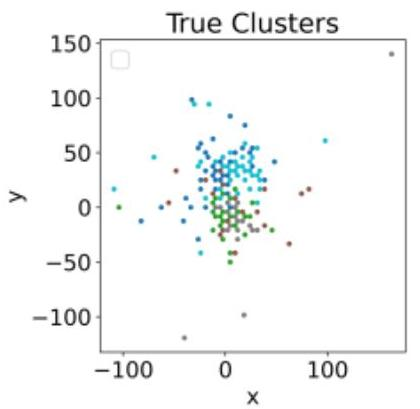
Figure 1: Example of cluster performance.

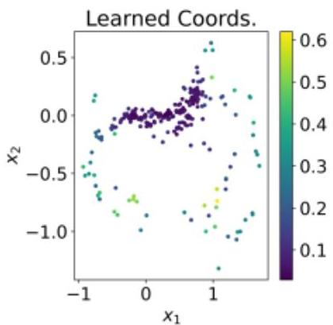

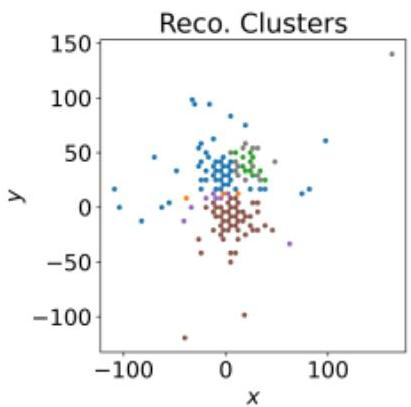

Clustering performance is evaluated on test data through comparisons to truth information. We define clustering efficiency as the fraction of all particles incident on the ECal that correspond to a found cluster with a matching particle ID. Clusters are assigned a particle ID based on the particle that composes the plurality of hits in the cluster. An additional requirement is placed on cluster "purity". We require that over  $50\%$  of the hits in the reconstructed cluster are associated with the correct truth particle. Clusters that do not satisfy this criteria are labeled as fake clusters. No selections are made on minimum cluster energy or distance from other incident particles.

Figure 2 shows clustering efficiency as a function of truth energy (left panel) and as a function of minimum distance between particles at the front face of the ECal (right panel). We see that efficiency is  $&gt;90\%$  for energies above  $\sim 5\mathrm{GeV}$ , approaching  $100\%$  at the full beam electron energy (8 GeV), and drops for lower energy particles. Lower energy clusters tend to be associated with the production of additional particles beyond the two primary beam electrons, and therefore tend to occur in events with more complex environments in the ECal. With larger numbers of incident particles, we are more likely to see cases of cluster overlap. In cases where the sum of energies in overlapping clusters is less than the beam energy, the algorithm may be unable to distinguish between a single cluster, and a cluster composed of more than one low-energy particle. This merged

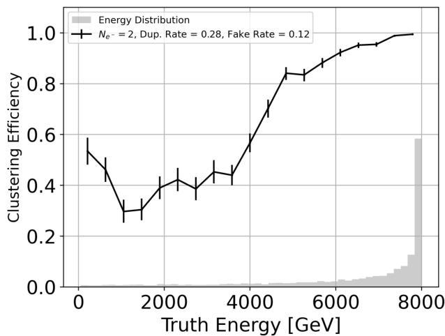
Figure 2: Clustering efficiency as a function of truth cluster energy (left) and minimum distance between particles at the front face of the ECal (right).

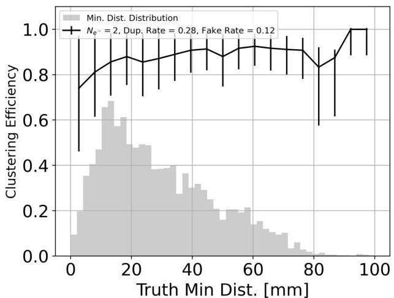

cluster degeneracy may explain the dip in efficiency at  $\sim 1$  GeV. We also note that the vast majority of events have energies near the beam energy. Poor performance at low energies may be explained by the lack of training data in this region. In any case, we are most interested in having high efficiency and energy/position resolution for electrons near the beam energy, for the purpose of their identification and removal. The right panel of Figure 2 shows that clustering efficiency as a function of minimum distance between incident particles is largely flat. This indicates that the algorithm is able to detect that more than one cluster is present, even in cases of significant overlap.

In addition to clustering efficiency, we are also interested in understanding energy and position resolution. Cluster energy and centroids are calculated from constituent hits after cluster-finding, rather than from any regression process. Figure 3 shows energy residuals (left panel), and position residuals (middle and right panels) for clusters found using the ML approach described here. The black distribution denotes all clusters, while the colored distributions show various bins in distance between beam electrons. We see that the energy resolution is rather poor for small beam electron separation—this population creates the tails we see in the overall energy residual. This suggests that although the algorithm is able to identify the presence of overlapping clusters, it does not necessarily correctly assign the constituent hits. For separations above  $\sim 15\mathrm{mm}$ , the residual distribution is shaped as expected, decreasing in spread with increasing distance. Position resolution shows a similar trend, with higher resolution for smaller electron distances.

Appendix C shows clustering efficiency, as well as energy and position residuals for clusters found using the standard LDMX clustering algorithm. The colored distributions in these plots correspond to events with different numbers of simulated electrons. The green curves, corresponding to the two-electron case, show the same events as used in the ML approach described here. Compared to the default clustering algorithm used in LDMX, we find that the ML approach has a stronger energy dependence, showing an improved clustering efficiency at high energies, with decreasing efficiency at lower energies. The ML approach also has a weaker dependence on the distance between clusters. While we see clustering efficiency approach zero for small electron separations in the default case, the ML approach does not show a similar trend. We see that position residuals in the  $x$  and  $y$  directions have broader tails in the standard clustering approach than in the ML approach.

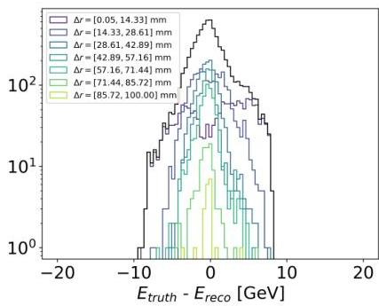
Figure 3: Energy (left),  $x$  position (middle), and  $y$  position (left) residuals. Black distribution shows all samples, while colored lines show various bins in distance between beam electrons.

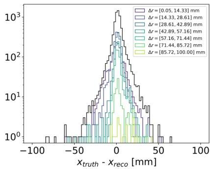

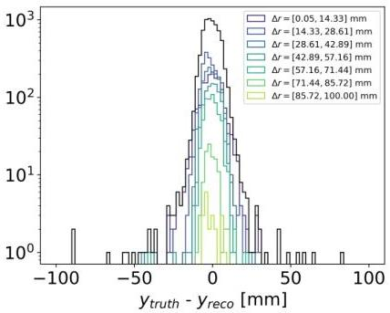

# 5 Conclusion and Future Work

A GNN-based clustering approach with object-condensation loss appears to be a promising method of beam-electron reconstruction in the LDMX ECal, particularly for electrons near the beam energy. While performance decreases for low-energy particles, high efficiency and energy/position resolution near the beam energy suggests that this clustering approach may be able to reliably identify non-interacting electrons, for later removal from multi-electron events. Performance at lower energies may also improve by re-weighting the training sample to include a larger number of low-energy electron events. This ML approach also succeeds in identifying individual clusters in cases of significant overlap, although energy and position resolution suffers in this regime. In future implementations, we may also include information from hits in the tracker modules. In addition to allowing automatic association between particle tracks and ECal clusters, the inclusion of tracking information may also help constrain cluster position and energy, potentially helping with the energy resolution of overlapping clusters.

# 6 Acknowledgements

I thank my advisor, Professor Lauren Tompkins, for her guidance throughout this project, and Thomas Klijnsma for providing examples of GravNet and object condensation implementations.

# References

[1] T. Åkesson et al., Photon-rejection power of the Light Dark Matter eXperiment in an 8 GeV beam, Journal of High Energy Physics 2023, 92 (2023), 2308.15173.
[2] Y. Wang et al., Dynamic Graph CNN for Learning on Point Clouds, ACM Trans. Graph. 38, 146:1 (2019).
[3] I. Henrion et al., Neural Message Passing for Jet Physics.
[4] H. Qu and L. Gouskos, ParticleNet: Jet Tagging via Particle Clouds, Physical Review D 101, 056019 (2020), 1902.08570.
[5] S. R. Qasim, J. Kieseler, Y. Iiyama, and M. Pierini, Learning representations of irregular particle-detector geometry with distance-weighted graph networks, The European Physical Journal C 79 (2019).

[6] J. Kieseler, Object condensation: one-stage grid-free multi-object reconstruction in physics detectors, graph, and image data, The European Physical Journal C 80 (2020).
- [7] S. R. Qasim, K. Long, J. Kieseler, M. Pierini, and R. Nawaz, Multi-Particle Reconstruction in the High Granularity Calorimeter Using Object Condensation and Graph Neural Networks, EPJ Web of Conferences 251, 03072 (2021).
- [8] Pytorch geometric documentation: GravNetConv, https://pytorch-geometric.readthedocs.io/en/2.5.2/generated/torch_geometric.nn.conv.GravNetConv.html.
- [9] L. N. Smith, Cyclical learning rates for training neural networks, 2017, 1506.01186.

## Appendix A Object Condensation Loss

This section details object condensation loss, as in *[6]*. In the object condensation approach, the neural network predicts a parameter $\beta$ for each vertex, which is used to define a charge $q$ give by:

$q_{i}=\text{arctanh}\beta_{i}+q_{min},$ (1)

where $q_{min}$ is an additional hyperparameter. The network also learned clustering coordinates $x$, which are used (with the charge $q_{i}$) to calculate an attractive and repulsive potential for each vertex. These potential terms are given by

$\hat{V}_{k}(x)$ $=||x-x_{\alpha}||^{2}q_{\alpha k}$ (2)
$\hat{V}_{k}(x)$ $=\max(0,1-||x-x_{\alpha}||)q_{\alpha k},$ (3)

where $q_{\alpha k}$ is the maximum charge of the vertices associated with a cluster $k$, and $x_{\alpha}$ is that vertex’s position in the learned clustering space. These potential terms are used in the following loss term:

$L_{V}=\frac{1}{N}\sum_{j=1}^{N}q_{j}\sum_{k=1}^{K}\left(\mathbbm{1}\{j\in k\}\bar{V}_{k}(x_{j})+(1-\mathbbm{1}\{j\in k\})\hat{V}_{k}(x_{j})\right).$ (4)

The above loss term incentivizes points $j$ that are in cluster $k$ to attract eachother, and points that are not in the same cluster to repel each other. An additional term is added to enforce one condensation point per cluster, and to penalize noise terms:

$L_{\beta}=\frac{1}{K}\sum_{k=1}^{K}(1-\beta_{\alpha k})+s_{B}\frac{1}{N_{B}}\sum_{i=1}^{N}n_{i}\beta_{i},$ (5)

where $s_{B}$ is a hyperparameter, and $n_{i}=1$ if point $i$ is a noise hit and 0 otherwise. Finally, if performing object property regression, we can add the additional loss term $L_{p}$, giving a total loss

$L=aL_{V}+bL_{\beta}+cL_{p}.$ (6)

The results presented here use $a=1,b=10$, and do no attempt to perform regression ($c=0$).

##

# B Clustering Examples

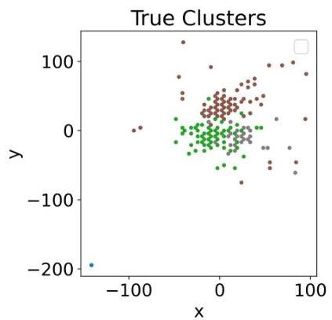

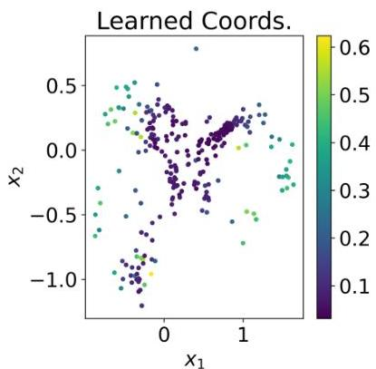

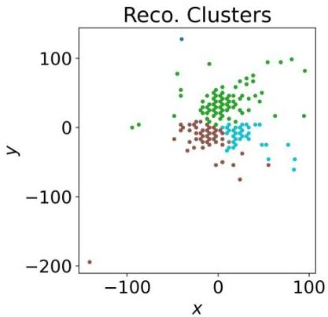

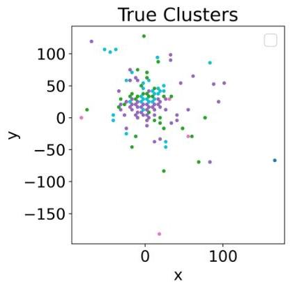

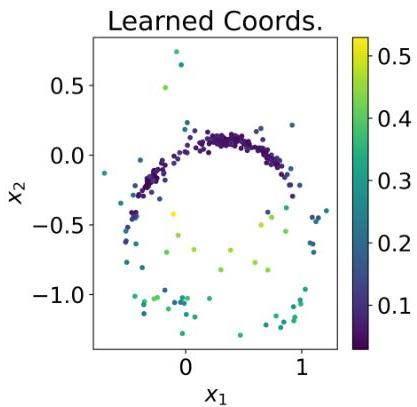

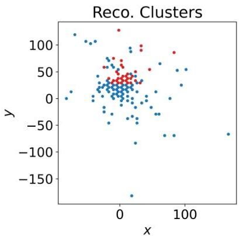

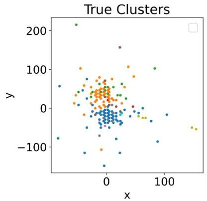
Figure 4: Examples comparing truth and reconstructed clusters on validation data. The middle panel shows points in the learned coordinate space, where the color is the value of  $\beta$ .

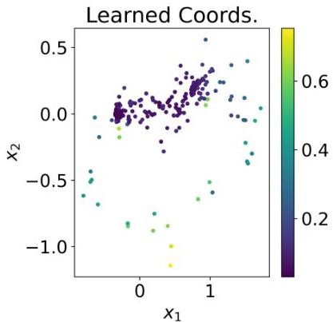

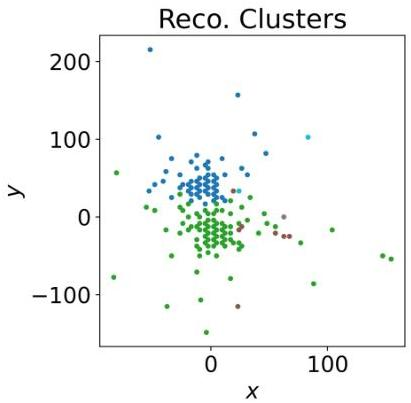

# C Comparison to standard LDMX clustering algorithm

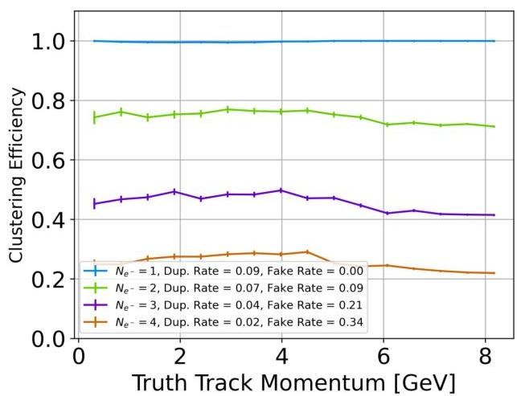
Figure 5: Clustering efficiency as a function of truth cluster energy (left) and minimum distance between particles at the front face of the ECal (right).

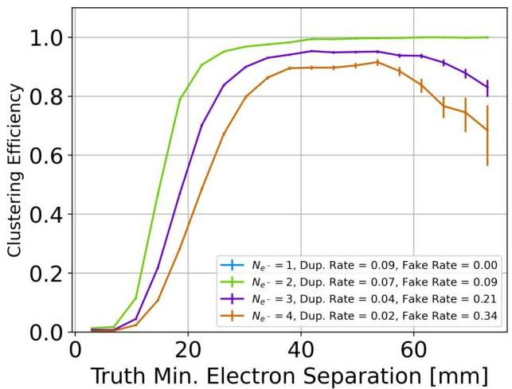

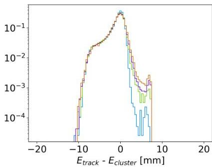
Figure 6: Energy (left),  $x$  position (middle), and  $y$  position (left) residuals. Black distribution shows all samples, while colored lines show various bins in distance between beam electrons.

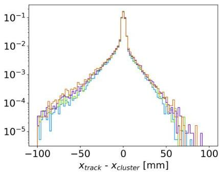

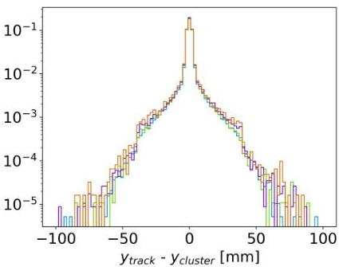

