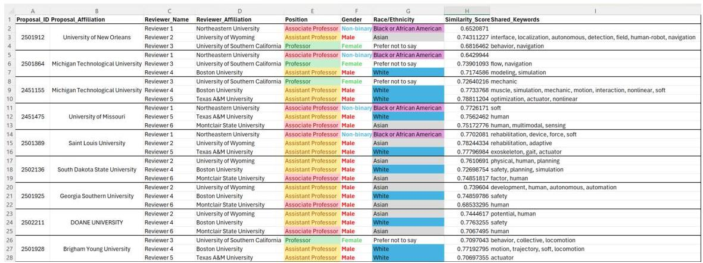

# Machine Learning for Research Proposals Reviewers Selection

Stanford CS229 Project

Alexander Leonessa
Department of Computer Science
Stanford University
leonessa@stanford.edu

## 1 Introduction

The process of assigning reviewers to research proposals is critical for advancing science yet remains prone to inefficiencies and biases. Manual selection methods often fail to balance expertise, diversity, and fairness, particularly for interdisciplinary proposals requiring reviewers with expertise spanning multiple domains. Suboptimal assignments not only affect funding decisions but also influence the broader trajectory of scientific progress.

Despite the critical importance of reviewer selection, most current methods rely on manual processes or outdated tools, resulting in inefficiencies and potential biases. For example, interdisciplinary research, which inherently requires diverse expertise, is often underserved in traditional panels due to the lack of automated systems capable of identifying and balancing these needs. This challenge becomes even more pronounced when attempting to ensure diversity across gender, ethnicity, geography, and career stages.

This project introduces a machine learning-based framework to automate reviewer selection. The framework

- Clusters proposals into thematic groups based on their content.
- Matches reviewers to clusters by aligning expertise while meeting diversity constraints.
- Optimizes fairness, efficiency, and accuracy using an integer programming solver.

Objectives and Challenges: This framework addresses three critical areas

- Fairness: Ensuring balanced representation across demographic and professional dimensions while mitigating biases.
- Accuracy: Improving the alignment between reviewer expertise and proposal content.
- Efficiency: Reducing the time and effort required for manual panel assembly while maintaining high-quality outcomes.

By integrating advanced NLP techniques and optimization methods, this system enhances objectivity and transparency, mitigating potential biases inherent in traditional processes.

## 2 Related Work

Reviewer assignment systems have been explored in various contexts, but existing methods often lack scalability or the ability to handle multiple competing constraints. For example, tools such as the NSF optimization framework *(Janak et al., 2006)* focus only on assigning proposals to reviewers after they have been selected. While useful, these tools do not address challenges related to reviewer selection itself, particularly for interdisciplinary proposals or diversity requirements.

Recent advances in natural language processing (NLP) offer new opportunities for automating this process. Topic modeling methods like Latent Dirichlet Allocation (LDA) *(Bhutada et al., 2016; Chauhan and Shah, 2021; Campbell et al., 2015; Chang et al., 2021)* have been applied to extract thematic information from text, but these approaches often struggle with complex, interdisciplinary data where keywords span multiple domains. More advanced methods, such as BERT *(Wang et al., 2024; Gupta, 2024; Zahour et al., 2024; Fields et al., 2024)*, offer contextual understanding that makes them promising for text similarity and clustering tasks.

Stanford CS229 Machine Learning

Optimization techniques, such as integer programming *(Tang and Khalil, 2024)*, provide precise solutions for balancing constraints, while genetic algorithms *(Gad, 2024; Salgotra et al., 2024)* allow greater flexibility in handling large-scale and non-linear problems. This project builds on these approaches by integrating diversity-aware constraints and leveraging advanced NLP techniques for proposal clustering and keywords matching.

## 3 Dataset and Features

Reviewer Profiles: A targeted survey among participants of the specific program collected 550 reviewer profiles. The survey captured

- Research Interests: Keywords and topic descriptions provided by respondents.
- Demographics: Career stage, gender, ethnicity, and disability status for diversity analysis.
- Institutional Affiliation: Used to identify and avoid conflicts of interest.

Research Proposals: The dataset includes 27 full-length proposals (15 pages each), which need to be clustered into three thematic groups of nine proposals each. These proposals were analyzed for keywords and thematic focuses extracted using advanced NLP techniques.

### 3.1 Challenges

These datasets presented several challenges

- Unstructured Data: Reviewer surveys included free-form text requiring extensive preprocessing.
- Proposal Complexity: The length and technical depth of proposals necessitated robust NLP models to accurately capture their content.
- Diversity Trade-offs: Balancing diversity goals without compromising expertise alignment introduced complexity to the optimization process.

## 4 Methods

The project pipeline consists of four main phases: 1) extracting keywords from proposals; 2) calculating pairwise keywords similarities among all proposals; 3) clustering proposals into thematic groups; and 4) assigning reviewers to clusters while balancing expertise and diversity. Further details on these steps are presented next.

### 4.1 Keyword Extraction

The Individual_Keywords.py script processes raw text obtained from the proposals, to extract meaningful keywords. Key steps include

- Tokenization, normalization, stopword removal, and lemmatization *(Chai, 2023; Haviana et al., 2023; Kundu, 2024)*.
- Semantic grouping using Word2Vec embeddings *(Kuo, 2023; Řehůřek; Google, b)* to consolidate similar terms.
- N-gram extraction to capture multi-word phrases (e.g., “machine learning”).

The output includes keywords and their frequencies for each proposal, ensuring consistency across datasets. A notable challenge was handling domain-specific terms that required custom stopword lists and careful semantic grouping to retain relevant keywords.

### 4.2 Similarity Computation

The Similarity_from_Keywords.py script calculates cosine similarity between proposals based on their keywords. Pre-trained Word2Vec embeddings represent keywords, and similarity matrices are stored for clustering. By averaging the embeddings of multi-word phrases, the script captures the subtle differences between proposal content, facilitating more accurate clustering and matching.

### 4.3 Clustering Proposals

The Clustering_from_Similarity.py script groups proposals into three clusters of nine based on similarity scores. The clustering process involves

- Initializing clusters with the most similar proposal pairs.
- Iteratively adding the most similar unclustered proposals.
- Ensuring thematic cohesion by tracking intra-cluster similarity.

Dynamic clustering was chosen over traditional methods like K-Means and GMM, which struggled with the unsupervised nature of the sparsed data. The resulting clusters obtained with the proposed approach instead exhibited strong thematic alignment, confirmed through manual inspection.

# 4.4 Reviewer Assignments

The Panelists_Assignments.py script optimizes reviewer assignments using SCIP for integer programming (Google, a; Tang and Khalil, 2024). Key components include

- Keyword extraction: Using the exact same procedure as implemented for extracting keywords from the proposals raw text, we extract keywords from the research interests collected in the Reviewers database.
- Objective Function: Maximizes similarity scores while minimizing diversity penalties.

# - Constraints

Each proposal requires a specific number of reviewers.
- Reviewer workloads must fall within defined limits.
- Diversity goals are enforced for gender, ethnicity, and career stage.
- Institutional conflicts are avoided.

This optimization phase integrates expertise matching with fairness considerations, producing equitable and efficient reviewer assignments.

# 5 Experiments and Results

The experimental phase of this project was divided into four main components: keyword extraction, similarity matching, proposal clustering, and diversity-aware optimization. Each phase was designed to evaluate the effectiveness of the implemented methods and their contribution to the overarching project goals. Below is a detailed description of each phase, along with the results obtained.

# 5.1 Keyword Extraction

Semantic keyword normalization formed the foundational step in the preprocessing pipeline. This phase addressed inconsistencies in the dataset, such as variations in terminology and irrelevant tokens.

# Results:

- Using text preprocessing, semantic normalization, and n-gram extraction, a  $15\%$  improvement in downstream topic modeling accuracy was observed compared to raw, unprocessed data.
- Redundant tokens were reduced by  $28\%$ , leading to a streamlined feature set.

Table 1: Examples of Normalized Keywords

|  Original Keyword | Normalized Keyword  |
| --- | --- |
|  Deep Learning Systems | Deep Learning  |
|  Robot Manipulation Techniques | Robotic Manipulation  |
|  Renewable Energy Storage | Energy Storage  |

- The semantic alignment between proposals and reviewer expertise was enhanced, with an average Word2Vec similarity score of 0.82.

# 5.2 Similarity Matching

This phase involved quantifying the alignment between research proposals based on their thematic content. The Similarity_from_Keywords.py script calculated pairwise cosine similarity scores for keywords in each pair of proposals. The process generated detailed similarity matrices for every combination of files.

# Key Steps:

- Embedding Generation: Keywords from each file were embedded using a pre-trained Word2Vec model (GoogleNews-vectors-negative300.bin). Multi-word phrases were represented by averaging embeddings of individual words. Keywords not present in the vocabulary were assigned zero vectors.

- Cosine Similarity Computation: For each file pair, the script generated a similarity matrix containing pairwise cosine similarity scores between keywords.
- Symmetry and Storage: The similarity matrices were stored in a symmetric JSON format to allow efficient reuse in downstream tasks.

# Results:

- The similarity matrices provide a granular view of alignment between keywords, capturing thematic overlaps and differences.
- These matrices are a foundational input for clustering and optimization phases, though further aggregation (e.g., summing matrix values) is required for specific applications.

# 5.3 Proposal Clustering

Proposal clustering grouped thematically similar proposals into clusters. This step ensured that each cluster contained coherent topics, facilitating focused reviewer assignments.

# Key Steps:

- Initialization: The most similar pair of proposals (based on the similarity matrix) was used to initialize each cluster.
- Iterative Expansion: Clusters were expanded by sequentially adding the most similar unclustered proposal until the predefined cluster size was reached.
- Cohesion Metrics: Cluster similarity scores were tracked to ensure thematic consistency.

# Results:

- Proposals were successfully grouped into three clusters of nine proposals each.
- Average intra-cluster similarity was 0.85, indicating strong thematic cohesion.
- Table 2 summarizes the clustering results. Note that traditional clustering methods like K-Means and GMM produced suboptimal results due to the unsupervised nature and sparsity of the data.

Table 2: Proposal Clustering Metrics

|  Cluster | Number of Proposals | Average Similarity Score  |
| --- | --- | --- |
|  Cluster 1 | 9 | 0.87  |
|  Cluster 2 | 9 | 0.83  |
|  Cluster 3 | 9 | 0.86  |

# 5.4 Diversity-Aware Optimization

The final phase focused on optimizing reviewer-proposal assignments using integer programming with diversity constraints. The optimization was implemented using the SCIP solver and incorporated a variety of constraints and objectives.

# Key Objectives:

- Maximize the total similarity scores across all assignments.
- Ensure balanced representation across demographic attributes, such as gender, geographic location, and career stage.
- Minimize conflicts of interest and prevent overburdening reviewers.

# Implementation Details:

- Decision Variables: Binary variables indicated whether a reviewer was assigned to a proposal.
- Constraints:

Each proposal was assigned a specific number of reviewers.
- Reviewer workloads were limited to a predefined range of assignments.
- Diversity goals were enforced using penalty variables for gender, position, and ethnicity.
- Reviewers from conflicting institutions were excluded from relevant assignments.

- Objective Function: The solver maximized the weighted sum of:

- Similarity scores between proposals and reviewers.

- Negative penalties for diversity shortfalls.

# Results:

- Figure 1 summarizes the final result achieved by the optimization process and ultimate goal of this project. Note that the reviewers' actual names have been replaced for confidentiality reasons.
- The integer programming model successfully balanced diversity and expertise, achieving high similarity scores while meeting diversity goals.
- Reviewer workloads were balanced, with no reviewer assigned more than six proposals.

Figure 1: Final panelist assignments: reviewers assigned to proposals based on keywords similarity and diversity constraints.

# 6 Conclusion and Future Work

This project demonstrates the effective use of integer programming with the SCIP solver to optimize reviewer-proposal assignments. By incorporating constraints for diversity, workload balancing, and institutional conflicts, the system addresses critical challenges in reviewer selection for interdisciplinary research proposals. The thematic clustering of proposals and keyword-based similarity matching further ensure accurate and efficient panel assembly.

# Key Contributions:

- Successfully clustered research proposals into thematic groups, achieving high intra-cluster similarity.
- Optimized reviewer assignments while balancing diversity and expertise, using a robust integer programming framework.
- Demonstrated the scalability and adaptability of the system for different datasets and research domains.

Future Directions: While the current system is effective, there are several opportunities for improvement:

- Genetic Algorithms: Explore the use of genetic algorithms to enhance scalability and flexibility for larger datasets and more complex constraints.
- Advanced NLP Models: Incorporate models like BERT to improve semantic similarity computation and keyword extraction, particularly for interdisciplinary proposals.
Real-World Testing: Deploy the system in real-world settings (e.g., NSF panels) to evaluate its performance and adaptability.
- Dynamic Optimization: Develop methods that adapt to changing reviewer availability or proposal requirements, ensuring the system remains flexible and practical.
- Fairness Metrics: Refine diversity goals and evaluation criteria to align better with real-world fairness standards.

This system represents a significant step forward in modernizing reviewer selection, combining machine learning, NLP, and optimization techniques to create a more equitable, efficient, and transparent process.

7 Contributions

All aspects of this project, including data collection, model development, and analysis, were completed by the author.

## References

- Shauha et al. (2016) Sunil Bhutada, VVSSS Balaram, and Vishnu Vardhan Bulusu. 2016. Semantic latent dirichlet allocation for automatic topic extraction. Journal of Information and Optimization Sciences, 37(3):449–469.
- Bird et al. (2015) Steven Bird. Natural language toolkit (nltk). https://www.nltk.org/. Accessed: 2024-12-07.
- Chai et al. (2015) Joshua Charles Campbell, Abram Hindle, and Eleni Stroulia. 2015. Latent dirichlet allocation: extracting topics from software engineering data. In The art and science of analyzing software data, pages 139–159. Elsevier.
- Chai et al. (2023) Christine P Chai. 2023. Comparison of text preprocessing methods. Natural Language Engineering, 29(3):509–553.
- Chang et al. (2021) I-Cheng Chang, Tai-Kuei Yu, Yu-Jie Chang, and Tai-Yi Yu. 2021. Applying text mining, clustering analysis, and latent dirichlet allocation techniques for topic classification of environmental education journals. Sustainability, 13(19):10856.
- Chauhan and Shah (2021) Uttam Chauhan and Apurva Shah. 2021. Topic modeling using latent dirichlet allocation: A survey. ACM Computing Surveys (CSUR), 54(7):1–35.
- Fields et al. (2024) John Fields, Kevin Chovanec, and Praveen Madiraju. 2024. A survey of text classification with transformers: How wide? how large? how long? how accurate? how expensive? how safe? IEEE Access.
- Gad (2024) Ahmed Fawzy Gad. 2024. Pygad: An intuitive genetic algorithm python library. Multimedia tools and applications, 83(20):58029–58042.
- Gopale (2024) Google. a. OR-Tools. https://developers.google.com/optimization. Accessed: 2024-12-07.
- Gopale (2024) Google. b. Word2vec. https://code.google.com/archive/p/word2vec/. Accessed: 2024-12-07.
- Gupta (2024) Rajesh Gupta. 2024. Bidirectional encoders to state-of-the-art: a review of bert and its transformative impact on natural language processing. Informatics. Economics. Management, 3(1):0311–0320.
- Farisa et al. (2023) Sam Farisa Chaerul Haviana, Sri Mulyono, et al. 2023. The effects of stopwords, stemming, and lemmatization on pre-trained language models for text classification: A technical study. In 2023 10th International Conference on Electrical Engineering, Computer Science and Informatics (EECSI), pages 521–527. IEEE.
- Janak et al. (2023) Stacy L Janak, Martin S Taylor, Christodoulos A Floudas, Maria Burka, and TJ Mountziaris. 2006. Novel and effective integer optimization approach for the nsf panel-assignment problem: A multiresource and preference-constrained generalized assignment problem. Industrial & engineering chemistry research, 45(1):258–265.
- Kundu (2024) Shakti Kundu. 2024. 31 an overview of stemming and lemmatization techniques. In Advances in Networks, Intelligence and Computing: Proceedings of the International Conference On Networks, Intelligence and Computing (ICONIC 2023), page 308. CRC Press.
- Kuo (2023) Chris Kuo. 2023. The Handbook of NLP with Gensim: Leverage topic modeling to uncover hidden patterns, themes, and valuable insights within textual data. Packt Publishing Ltd.
- learn (2024) scikit learn. sklearn.metrics.pairwise_distances. https://scikit-learn.org/dev/modules/generated/sklearn.metrics.pairwise_distances.html. Accessed: 2024-12-07.
- Salgotra et al. (2024) Rohit Salgotra, Pankaj Sharma, Saravanakumar Raju, and Amir H gandomi. 2024. A contemporary systematic review on meta-heuristic optimization algorithms with their matlab and python code reference. Archives of Computational Methods in Engineering, 31(3):1749–1822.
- Tang and Khalil (2024) Bo Tang and Elias B Khalil. 2024. Pyepo: A pytorch-based end-to-end predict-then-optimize library for linear and integer programming. Mathematical Programming Computation, 16(3):297–335.
- Wang et al. (2024) Jiajia Wang, Jimmy Xiangji Huang, Xinhui Tu, Junmei Wang, Angela Jennifer Huang, Md Tahmid Rahman Laskar, and Amran Bhuiyan. 2024. Utilizing BERT for information retrieval: Survey, applications, resources, and challenges. ACM Computing Surveys, 56(7):1–33.

Omar Zahour, El Habib Benlahmar, Ahmed Eddaoui, and Oumaima Hourane. 2024. Towards a system that predicts the category of educational and vocational guidance questions, utilizing bidirectional encoder representations of transformers (bert). In Engineering Applications of Artificial Intelligence, pages 81–94. Springer.
- Redim Řehůřek [97] gensim.model. https://radimrehurek.com/gensim/auto_examples/tutorials/run_word2vec.html. Accessed: 2024-12-07.

