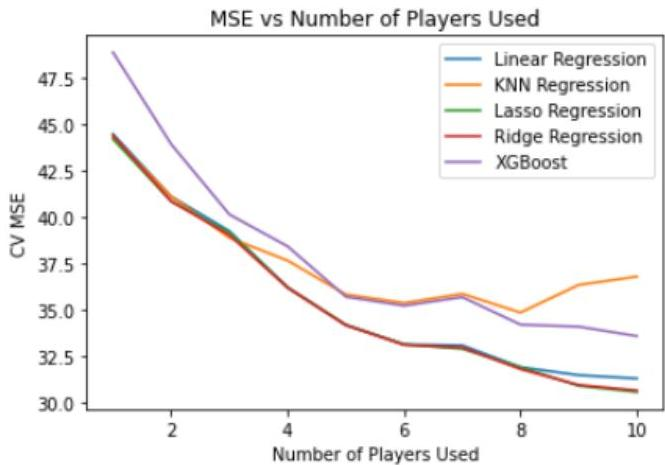
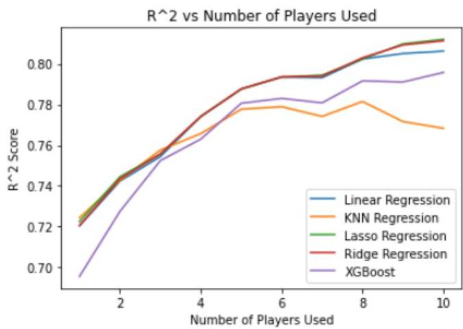
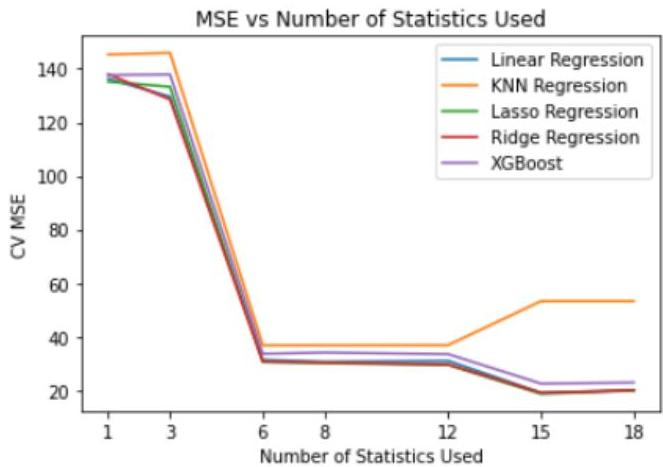
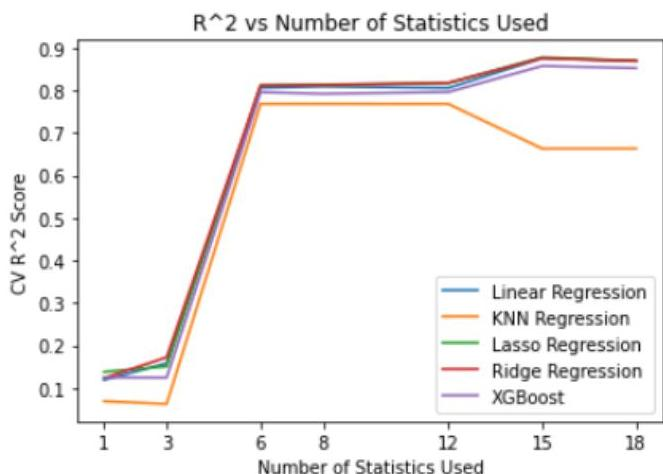

NBA Team Success by Player Personnel

Memphis Lau

Stanford University

Abstract
This study explores the feasibility of predicting NBA team success, quantified by season wins, based solely on player statistics. By focusing on the performance metrics of top-performing individual players, we aim to assess the predictive power of various Machine Learning models while intentionally excluding factors such as team chemistry, coaching decisions, and scheduling impacts. We systematically analyze datasets that encompass a range of player statistics, experimenting with subsets corresponding to the top n players, and incorporating diverse performance metrics including points, rebounds, assists, steals, blocks, shooting percentages, and advanced statistics. The predictive capabilities of linear regression, ridge regression, lasso regression, KNN regression, and XGBoost regressors are evaluated across these varying data dimensions. Our findings illustrate the influence of dimensionality on model performance and highlight the extent to which individual player statistics can serve as a proxy for team success. Ultimately, this research aims to contribute valuable insights to sports analytics, offering a quantitative perspective on the relationship between player performance metrics and overall team outcomes in the NBA.

## 1 Introduction

Success in basketball at the professional level is a culmination of player talent, coaching, team chemistry, player development, and of course, luck. However, throughout the last few years, we have seen more teams attempt to build ”superteams”, acquiring as many talented superstar players on the team as possible, often sacrificing chemistry and not prioritizing coaching improvements. These teams often have varying results. For example, the 2021 Brooklyn Nets with 5 future Hall-of-Fame players finished with only 48 wins in an 82-game season, while the star-studded 2018 Warriors accomplished 58 wins. NBA fans often understand the importance of chemistry and coaching, yet sometimes NBA owners prioritize having as many 20-point-per-game scorers as they can. My project aims to predict a team’s wins based purely on its players’ statistics for that season and analyze methods for doing so.

In this project, I use multiple self-generated datasets with varying amounts of predictors to predict a team’s win total. I use linear regression, ridge and lasso regression, KNN regression, and an XGBoost regressor to model the data. The objective is to achieve the lowest test MSE or the highest $R^{2}$ score and find the best fitting model.

## 2 Related Works

Much of previous work aims to predict individual NBA games, then sum them up to get a win percentage. This essentially turns this problem into a a sum of binary classification problems (whether a team will win or not) and factors scheduling into consideration.

I found similar work to my project by Stanley Yang (2015) *[1]*, which looks at the correlation between team win percentage and individual player statistics. His work proved a somewhat obvious claim that teams with higher-performing players tend to win more games, with slight error due to coaching, team depth,

or chemistry. While this conclusion is crucial to my project, my inquiry expands on it, asking just how well a team’s win total can be predicted by its players’ stats.

In addition, I came across an old CS 229 project by Giarta, et al. *[2]* that attempted to predict team win totals by using the players’ statistics from their previous season. This project idea allows them to predict the future season’s win totals before it starts just by using the players on every roster, which could be beneficial for sports betting. However, it ignores rookies, who can have varying degrees of impact, and may be underestimating or overestimating players who are put in new teams and roles. My project tackles an entirely different question: how well we can predict team win totals with the players’ stats from the same season, aiming to understand the hidden effects of chemistry and coaching. In addition, this older project only uses linear regression and focuses more on feature reduction, mine will use several different modeling methods and experiment with different datasets.

## 3 Dataset and Features

### 3.1 Data Sources

The data for this project was downloaded from Kaggle.com from this link. It contains data for both teams and players, with several hundreds of columns for each.

### 3.2 Dataset Creation

In this project, I experimented with many different datasets for modeling. In every dataset, each row represented a team in a given season (i.e. 1996-97 Utah Jazz or 2015-16 Miami Heat). There are 802 rows. In each row were the response variable (number of wins) and a varying amount of predictors. By merging datasets, I grabbed the top $m$ players from a team in terms of minutes played and $p$ statistics for those players. I chose to use minutes played, instead of points-per-game because I felt minutes played is more indicative of who provided value for a team in a given season. Each dataset created had $n=m\times p$ predictors. For example, in a dataset, each row may have 6 statistics (PTS, REB, AST, USG_PCT, E_OFF_RATING, E_DEF_RATING) for the top 10 players on the team in terms of minutes played, labeled 1st_PTS, 2nd_PTS, etc. I created a function so that these datasets can be generated easily by inputting a list of the stats and the number of players to look at.

One categorical variable I viewed as potentially useful was Position. I believed it would matter whether a team’s best player was a Center or a Point Guard. In order to model with this, I used dummy variables to represent the possible values for position (G, G-F, F, F-C, C). However, this did not lead to better results, so I left it out of the final experimentation.

The list of features used in total can be found in the appendix. It was important that none of the player statistics corresponded directly with team success, as that could skew my results, such as player plus-minus or player win shares, which are measurements that can tell a model if a team is successful regardless of player statistics.

## 4 Methods

### 4.1 Models

For this regression problem, I chose to experiment with several different models. The first is simply linear regression, which using scikit-learn, analytically solves for $\theta$ using least squares. Because there can be such a high amount of predictors, I also try ridge and lasso regression as regularization techniques. Those aim to minimize $J(\theta)=\|y-X\theta\|^{2}+\lambda\|\theta\|^{2}$ and $J(\theta)=\|y-X\theta\|^{2}+\lambda|\theta|$, respectively. This $\lambda$ is found through cross-validation using GridSearchCV, which

4.2 Evaluation of the Models

5 RESULTS

trains the model through the possible  $\lambda$  values of  $[10^{-4}, 10^{-3}, 10^{-2}, 10^{-1}, 1, 10^{1}, 10^{2}, 10^{3}, 10^{4}]$  and finds the best performing one in terms of average MSE through k-folds of data.

Next is a K-Nearest Neighbor Regressor, which takes a test point and looks at its K nearest points based on Euclidean distance and averages the y-value of these points. I used this method in hopes that the model would be able to find historically comparable teams (for example, teams with strong performing duos and a weaker third and fourth best player) and perform well. Due to the size of the data, I used  $\mathrm{k} = 10$ .

Another model I tried was an XGBoost Regressor, where decision trees are trained iteratively on the residuals. This method is powerful and can capture complex relationships. The parameters of this were also found using cross-validation, namely the learning rate, the sample of data used for each boosting iteration, and the  $\lambda$  for L1 regularization.

It should be added that I also experimented used a neural network with two hidden layers. However, due to possible overfitting, the neural network was outperformed by other models. Due to the computational time to retrain neural networks 10 times during 10-fold cross validation, I decided to leave this out of the project.

# 4.2 Evaluation of the Models

The models were evaluated with two metrics: mean squared error and  $R^2$  score. These scores were both calculated using 5-fold cross validation. The data is split into 5 groups; all models are trained on all but one group; I evaluate the MSE and  $R^2$  score on the left out group and repeat for the four other groups. The average of these mean squared errors and  $R^2$  scores is the final cross-validation error or  $R^2$  score. This method was computationally more expensive, but provided a better estimate of the effectiveness of the models than simply using a singular validation set.

# 5 Results

# 5.1 Number of Players

First, I evaluated the effect of how many players are used as predictors. I used a basis set of statistics (PTS, REB, AST, USG_PCT, E_OFF_RATING, E_DEF_RATING), six factors that I felt represented a player's performance well in totality. I varied the number of players considered from 1 to 10, using the n-th top players in terms of minutes played during the season. This would result in  $6 \times n$  predictors for each dataset.

The general pattern is that with more players considered, the models perform better in terms of cross-validation MSE. This intuitively makes sense, as more information leads to better modeling. It is also interesting to see that Lasso and Ridge Regression perform the best out of all the models attempted. The plot for the  $R^2$  score tells the same story.

5.2 Number of Statistics

5 RESULTS

# 5.2 Number of Statistics

Next, I experimented with the number of statistics to be considered. Seeing that 10 players provides the best results, I used the top 10 players in terms of minutes played for all of the following models. I used 1, 3, 6, 8, 12, 15, and 18 statistics. The exact variables used can be found in the Appendix.

Again, the more information there is, generally the better the model performs. Also consistent is the fact that Lasso and Ridge perform the best out of the attempted models.

The best 10-fold CV error achieved was with a Lasso regression on the dataset with 15 statistics from 10 players. The mean squared error was 18.613, with an  $R^2$  score of 0.878.

# 5.3 Important Features

To extract feature importance from the models trained on the best dataset, I look at both the coefficients from linear regression and the feature importance from XGBoost.

# 5.3.1 Linear Regression

Running a linear regression on the standardized data, the highest coefficient (in absolute value) is '1st_PIE', or the Player Impact Estimate of the player who played the most minutes. This is followed by '2nd_PIE' and '2nd_FG3A', the number of three point attempts for the second leading minute player. The most negative coefficient is '1st_PTS', indicating a negative correlation between a team's win total and the number of points scored by its "best" player. The entire top 10 variables in terms of the absolute value of the coefficient can be found in the Appendix.

Grouping by stat, the measure with the highest average coefficient (absolute value) is Player Impact Estimate, followed by 3-point field goals made and attempted, then points scored. The variables with coefficients closest to 0 are steals and blocks.

Grouping by player, the highest average coefficient belongs to the 1st ranked player, followed by the second. The next two highest are surprisingly the fifth and the eighth.

# 5.3.2 XGBoost

One of the benefits of using XGBoost is the ability to see feature importance. Grouping by stat, the XGBoost algorithm finds the players' offensive and defensive rating the most important. Grouping by player, the algorithm gives the most importance to the 1st, then 2nd, then 5th, then 3rd highest minute players.

6 Discussion

The clear result from the plots is that with more information, whether that be players or statistics, models generally perform better. It is interesting to see that Ridge and Lasso regression outperform the other models. This is most likely due to the fact that there are many predictors and not a large amount of observations. For example, with 6 stats and 10 players, the dataset is a 802x61 table. Modeling on this dataset can easily fall victim to overfitting, as complex models will try to fit the data too closely and capture a lot of noise. This probably happens with XGBoost, causing its MSE score to be quite high. In KNN Regression, at some point, with added dimensionality, the model performs worse. With a high amount of dimensions, the K-Nearest neighbors are harder to find and may not be indicative of the true relationship. This is why we see a rise in the MSE for the KNN Regressor from 8 to 10 players used and from 12 to 15 variables used. The problem with overfitting is slightly countered by Lasso and Ridge regression, hence its superior performance. The regularization that both these models provide allow them to not overfit the noise and thus perform better on cross-validated sets.

The feature importances are interesting, but ultimately difficult to interpret confidently. Linear regression seems to value Player impact Estimate, implying that successful teams’ top minute players are those that are most involved. The most actionable insight is that the model values three point attempts and makes. Further investigation shows that the majority of these coefficients are positive, indicating that successful teams should have shooting ability from most of their players. When grouping by players, it is no surprise that the statistics from the 1st leading minute player and the 2nd are the most important. My intuition for the high coefficient for the 5th ”best” player is that the model sees the value of having a well-performing fifth best player which usually implies a strong starting 5. A team is more likely to win if it can have five good players on the court, with no weaknesses for the opposing team to pick on. In addition, the 8th player’s statistics being important point me towards the fact that most teams only play an 8-man rotation in important games. If the 8th man is a solid player, hopefully this implies that the 1st-7th are as well, and thus, the team is strong enough to compete in competitive games.

## 7 Conclusion

My project illustrated how to achieve the best model to predict NBA team wins from only looking at players’ statistics. Experimenting and making sense of different modeling techniques, the best performing model is a Lasso regression that looks at 15 different variables across 10 players and achieves an $R^{2}$ score of 0.878. The remaining $\hat{1}2\%$ of the variation is most likely due to coaching, team chemistry, scheduling, and/or luck. The model’s results imply that team success is correlated with the three-point shooting ability of every member on the team and building team depth (especially the 5th and 8th best players).

To expand upon this project in the future, I could incorporate player combinations (think of Kobe and Shaq), player salaries, interactions between players’ statistics, or player histories. Feature selection could also elevate this project, attempting to combat overfitting by only using important features. The statistics used in this project were chosen by me by my personal intuition about basketball data, but algorithm-based feature selection could improve the performance.

8 APPENDIX

# 8 Appendix

# 8.1 Statistics Used

- PTS: points scored
- REB: rebounds
- AST: assists (passes leading to score)
- E_OFF_RATING: offensive efficiency rating (number of points a team scores per 100 possessions when the player is on the court)
- E_DEF_RATING : defensive efficiency rating (number of points a team allows per 100 possessions when the player is on the court)
- USG_PCT: usage percentage (formula for calculating player's involvement in scoring)
- STL: steals
- BLK: blocks
- FG3A: 3 point field goals attempted

- FG3M: 3 point field goals made
- TOV: turnovers
- PF: personal fouls
- PIE: Player Impact Estimate (statistic designed by ESPN to quantify a player's overall contribution)
- POSS: number of possessions (number of opportunities a team has to score)
- TS_PCT: true shooting percentage (formula to that uses field goal percentage, 3 point percentage, and free throw percentage)
- PTS_PAINT: number of points in paint (area close to basket)
- DD2: number of double-doubles (double digits in two stat categories)
- TD3: number of triple-doubles (double digits in three stat categories)

Table 1: Statistics Used for Modeling

|  # of Stats | Stat Names  |
| --- | --- |
|  1 | PTS  |
|  3 | PTS, REB, AST  |
|  6 | above + USG_PCT, E_OFF_RATING, E_DEF_RATING  |
|  8 | above + STL, BLK  |
|  12 | above + FG3A, FG3M, TOV, PF  |
|  15 | above + PIE, POSS, TS_PCT  |
|  18 | above + PTS_PAINT, DD2, TD3  |

8.2 Feature Importance

8 APPENDIX

# 8.2 Feature Importance

Table 2: Linear Regression Top Coefficients

|  Variable | Coefficient  |
| --- | --- |
|  1st_PIE | 4.92324  |
|  2nd_PIE | 2.2631  |
|  2nd_FG3A | 2.06645  |
|  1st_PTS | -1.96558  |
|  2nd_FG3M | -1.89045  |
|  3rd_PIE | 1.84716  |
|  1st_REB | -1.78179  |
|  1st_POSS | 1.69631  |
|  7th_PIE | 1.5783  |
|  2nd_USG_PCT | -1.51765  |

Table 3: Linear Regression Coefficients by Statistic

|  Statistic | Average Coefficient  |
| --- | --- |
|  PIE | 1.480541  |
|  FG3M | 0.813231  |
|  FG3A | 0.775670  |
|  PTS | 0.615535  |
|  E_DEF_RATING_RANK | 0.557643  |
|  REB | 0.525133  |
|  POSS | 0.516269  |
|  E_OFF_RATING_RANK | 0.494064  |
|  USG_PCT | 0.455513  |
|  TOV | 0.412625  |
|  AST | 0.407682  |
|  TS_PCT | 0.269149  |
|  PF | 0.236470  |
|  STL | 0.178306  |
|  BLK | 0.171892  |

Table 4: Linear Regression Coefficients by Players

|  Player | Average Coefficient  |
| --- | --- |
|  1st | 0.995929  |
|  2nd | 0.835384  |
|  5th | 0.600050  |
|  8th | 0.517853  |
|  4th | 0.513500  |
|  3rd | 0.510240  |
|  6th | 0.384795  |
|  7th | 0.347221  |
|  10th | 0.312061  |
|  9th | 0.256117  |

10 REFERENCES

# 9 Contributions

I worked on this project alone.

# 10 References

[1] Yang, Yuanhao (Stanley). Predicting Regular Season Results of NBA Teams Based on Regression Analysis of Common Basketball Statistics. University of California at Berkeley, May 2015. link

[2] Giarta, Evan and Asavareongchai, Nattapoom. Predicting Win Precentage and Winning Features of NBA Teams. University of Stanford. link

